ProPublica’s COMPAS Data Revisited
================
Matias Barenstein
July 08, 2019

<!-- This is an almost identical copy of my program that created my arXiv paper v3 July 8, 2019 -->

<!-- <https://arxiv.org/abs/1906.04711> -->

<!-- Except this program creates a github_document instead of a PDF (see further notes on this below) -->

<!-- Here I am creating a github_document file. So I had to implement some formatting changes for github -->

<!-- Especially in the YAML and front matter -->

<!-- At the same time, I may leave in some things that are more specific to latex pdf -->

<!-- as long as they do not produce any error messages here  -->

<!-- In addition to the changes that I already had to implement for the html_document version -->

<!-- For this github_document version I had to implement additional changes -->

<!-- More changes to YAML and front matter -->

<!-- Figures - I use the captioner package to create figure captions -->

<!-- since github_document format does not run with fig_caption: true in YAML -->

<!-- Tables - I commented out some of the kable tables -  -->

<!-- especially the ones with an add_header_above command, which does not appear to work in github_doc -->

<!-- and for these, I just pasted the actual table output  -->

<!-- from the md markdown document produced by the html_document keep_md: true  -->

<!-- I use a different citations style here (which puts more active links to the cites) -->

<!-- I now use - csl: the-journal-of-real-estate-finance-and-economics.csl -->

<!-- Instead of - csl: american-statistical-association.csl -->

<!-- NOTE_Writing_edit -->

<!-- Relative to arXiv PDF this has the following edits -->

<!-- Citation package is different -->

<!-- References look the same in body, but have active links in reference section -->

<!-- First footnote had to repeat it in body to have it show up in that initial section -->

<!-- Corrected FPV to FPR -->

**Abstract**

> I examine the COMPAS recidivism risk score and criminal history data
> collected by ProPublica in 2016 that fueled intense debate and
> research in the nascent field of ‘algorithmic fairness’. ProPublica’s
> COMPAS data is used in an increasing number of studies to test various
> definitions of algorithmic fairness. This paper takes a closer look at
> the actual datasets put together by ProPublica. In particular, the
> sub-datasets built to study the likelihood of recidivism within two
> years of a defendant’s original COMPAS survey screening date. I take a
> new yet simple approach to visualize these data, by analyzing the
> distribution of defendants across COMPAS screening dates. I find that
> ProPublica made an important data processing error when it created
> these datasets, failing to implement a two-year sample cutoff rule for
> recidivists in such datasets (whereas it implemented a two-year sample
> cutoff rule for non-recidivists). When I implement a simple two-year
> COMPAS screen date cutoff rule for recidivists, I estimate that in the
> two-year general recidivism dataset ProPublica kept over 40% more
> recidivists than it should have. This fundamental problem in dataset
> construction affects some statistics more than others. It obviously
> has a substantial impact on the recidivism rate; artificially
> inflating it. For the two-year general recidivism dataset created by
> ProPublica, the two-year recidivism rate is 45.1%, whereas, with the
> simple COMPAS screen date cutoff correction I implement, it is 36.2%.
> Thus, the two-year recidivism rate in ProPublica’s dataset is inflated
> by over 24%. This also affects the positive and negative predictive
> values. On the other hand, this data processing error has little
> impact on some of the other key statistical measures, which are less
> susceptible to changes in the relative share of recidivists, such as
> the false positive and false negative rates, and the overall accuracy.

  
  
  
Keywords: Fair Machine Learning, Algorithmic Fairness, Recidivism, Risk,
Bias, COMPAS, ProPublica  
  
  
First version on arXiv: **June 11**, 2019. E-mail:
<mbarenstein@gmail.com>. The author is a staff economist at the Federal
Trade Commission (FTC). This study was conducted independently of his
work at the FTC. The views expressed in this article are those of the
author. They do not necessarily represent those of the Federal Trade
Commission or any of its Commissioners. I thank Federico Echenique for
his comments on this paper.[1](#FN-1)
<!-- NOTE_Writing_edit - I repeated footnote to have it appear on first page -->  
  
  

<!-- I add section numbers manually, to match section numbers automatically created in pdf and html versions -->

<!-- Since github_document format does not run with number_sections: true in YAML -->

# 1 Introduction

Due to the rise in data collection and its use, as well as the
accompanying development of more predictive and complex machine learning
models, and the still nascent field of artificial intelligence, the past
several years has seen a marked spike in interest and research regarding
what is now often referred to as “algorithmic fairness” or “fair machine
learning.” (See Corbett-Davies and Goel
[2018](#ref-2018arXiv180800023C); Cowgill and Tucker
[2019](#ref-Cowgill_Tucker); Kleinberg et al.
[2018](#ref-Kleinbergetal2018))[2](#FN-2)

One notable event in the chronological development of this field, which
helped propel the interest and research into algorithmic fairness, was
the ground-breaking investigative journalism work of ProPublica on the
COMPAS recidivism risk score, which is sometimes used to aide various
decisions in the judicial system.[3](#FN-3) In 2016, a team
of journalists from ProPublica constructed a dataset of defendants from
Broward County, FL, who had been arrested in 2013 or 2014 and assessed
with the COMPAS risk screening system. ProPublica then collected data on
future arrests for these defendants through the end of March 2016, in
order to study how the COMPAS score predicted recidivism (Angwin et al.
[2016](#ref-ProPublica_article)).

Based on its analysis, focusing on one set of predictive metrics,
ProPublica concluded that the COMPAS risk score was biased against
African-Americans. The company that developed the COMPAS risk scoring
system, Northpointe Inc., focusing on a different set of predictive
metrics, defended the risk scores as unbiased (Dieterich et al.
[2016](#ref-Northpointe_Report)). This sparked intense debate and
research on the various possible definitions of algorithmic fairness.
Some of this work has been primarily theoretical. For example, the work
showing the impossibility of simultaneously attaining some of the more
popular fairness goals (Chouldechova [2016](#ref-2016arXiv161007524C);
Kleinberg et al. [2018](#ref-Kleinbergetal2018)).

ProPublica’s investigation was truly ground-breaking since it used
public records requests to obtain COMPAS scores and dates and personal
information on a group of defendants, as well as prison and jail
information for them, and was able to match and merge these disparate
data sources. Moreover, perhaps for full transparency and following best
practices for reproducibility, ProPublica made the dataset it collected
available to the public. As a result, the ProPublica COMPAS data has
become one of the key bench-marking datasets with which a growing number
of researchers have tested novel algorithmic fairness definitions and
procedures. Indeed, it has become perhaps the most widely used dataset
in the field of algorithmic fairness (e.g. Corbett-Davies and Goel
[2018](#ref-2018arXiv180800023C); Bilal Zafar et al.
[2016](#ref-2016arXiv161008452B), [2017](#ref-2017arXiv170700010B);
Chouldechova [2016](#ref-2016arXiv161007524C); Corbett-Davies et al.
[2017](#ref-2017arXiv170108230C); Cowgill
[2018](#ref-Cowgill_Recidivism); Rudin et al.
[2018](#ref-2018arXiv181100731R)).
<!-- These are only a few. There are many more algorithmic fairness (or fair machine learning) papers that use the ProPublica COMPAS dataset. -->

While ProPublica’s COMPAS data is used in an increasing number of
studies, researchers have taken the datasets created by ProPublica as
they are and do not appear to have examined them closely for data
processing issues.[4](#FN-4) Instead of testing a novel
fairness definition or procedure, I take a closer look at the actual
datasets put together by ProPublica. In particular, the sub-datasets
built to study the likelihood of recidivism within two years of the
original offense and COMPAS screening date. I take a new yet simple
approach to visualize these data, by analyzing the distribution of
defendants across COMPAS screening dates. Doing so, I find that
ProPublica made an important data processing error creating some of the
key datasets most often used by other researchers.

ProPublica failed to implement a two-year sample cutoff rule for
recidivists in the two-year recidivism datasets (whereas it implemented
a two-year sample cutoff rule for non-recidivists in the same datasets).
As a result, ProPublica incorrectly kept a disproportionate share of
recidivists in such datasets. This data processing mistake leads to
biased two-year recidivism datasets, with artificially high recidivism
rates. To my knowledge, this is the first paper to highlight this key
data processing mistake.

To construct these two-year recidivism sub-datasets, ProPublica
presumably wanted to keep people observed for at least two years at the
end of the time window for which ProPublica collected criminal history
data, on April 1, 2016. Therefore, we should not have expected to see
anybody in the two-year datasets with COMPAS screening (or arrest) dates
after April 1, 2014 (i.e. less than two years prior to ProPublica’s data
collection). However, as we will see further below, there are many
people in ProPublica’s two-year recidivism datasets who do indeed have
COMPAS screening dates after this potential cutoff, all the way through
December 31, 2014, which is the end date of the original database.

Taking a closer look at these datasets, I find that ProPublica correctly
dropped non-recidivists with COMPAS screening dates post 4/1/2014.
However, it kept people with COMPAS screening dates after 4/1/2014 if
they recidivated. ProPublica’s data processing logic that created the
two-year recidivism datasets is as follows: keep a person if they are
observed for at least two years OR keep a person if they recidivate
within two years. Unfortunately, this results in a biased sample for the
two-year recidivism datasets.[5](#FN-5)

As I show in this paper, the bias in the two-year datasets is clear,
there are a disproportionate number of recidivists. When I implement a
simple two-year COMPAS screen date cutoff rule for recidivists, I
estimate that in the two-year general recidivism dataset ProPublica kept
over 40% more recidivists than it should have. This fundamental problem
in dataset construction affects some statistics more than others. It
obviously has a substantial impact on the recidivism rate. It
artificially inflates the recidivism rate. For the two-year general
recidivism dataset created by ProPublica, the two-year recidivism rate
is 45.1%, whereas with the simple COMPAS screen date correction I
implement, it is 36.2%. Therefore, the two-year recidivism rate in
ProPublica’s two-year dataset is inflated by over 24%. This also affects
the positive predictive value (PPV) or precision, and the negative
predictive value (NPV). On the other hand, it has relatively little
impact on several other key statistics that are less susceptible to
changes in the relative share of recidivists versus non-recidivists,
such as accuracy, the false positive rate (FPR), and the false negative
rate (FNR).[6](#FN-6)

In the remainder of this paper, Section 2 briefly discusses the data
collected by ProPublica. Section 3 examines in detail the data
processing mistake just highlighted. Section 4 shows how this mistake
artificially inflates the two-year general recidivism rate. In Section
5, I replicate ProPublica’s confusion matrix analysis with the original
two-year data, and then show the analogous results with the corrected
COMPAS screen date cutoff, finding that in addition to the recidivism
rate (or prevalence), the PPV, NPV, and detection rate, are also
substantially impacted, but the FPR, FNR, and accuracy are not. Section
6 concludes. The Appendix discusses various key data and analysis
assumptions, as well as some extensions.

# 2 Data

ProPublica obtained a dataset of pretrial defendants and probationers
from Broward County, FL, who had been assessed with the COMPAS screening
system between January 1, 2013, and December 31, 2014. COMPAS recidivism
risk scores are based on a defendant’s answers to the COMPAS screening
survey. The survey is completed by pre-trial services in cooperation
with the defendant after his or her arrest.[7](#FN-7) The
COMPAS survey, at least in the ProPublica data, is typically
administered the same day or the day after a person is
jailed.[8](#FN-8)

For the more than 11 thousand *pretrial* defendants in this
dataset,[9](#FN-9) ProPublica then collected data on future
arrests through the end of March 2016, in order to study how the COMPAS
score predicts recidivism for these defendants.[10](#FN-10)

ProPublica collected the data for its study and created a (Python)
database. From that database, it constructed various sub-datasets that
merged and calculated various important features. For example, an
indicator for a re-arrest for a new crime within two years of the
original one, and the period of time between arrests. ProPublica then
exported these sub-datasets into .csv files.[11](#FN-11)
These files are the ones most often used by other researchers (see
references in the [introduction](#introduction)).

I primarily use two of the .csv files that ProPublica created. These
were named by ProPublica “compas-scores.csv” and
“compas-scores-two-years.csv”. The first file contains the full
dataset of *pretrial* defendants that ProPublica obtained from the
Broward County Sheriff’s Office. This file contains 11,757
people.[12](#FN-12) This total is trimmed down by ProPublica
to 10,331 people (I discuss the trimming done by ProPublica in the
[Appendix](#full-data-drops)).

The second file I use is a file that ProPublica created for the purpose
of studying two-year general recidivism. The term *general* recidivism
is used to distinguish it from the smaller subset of *violent*
recidivism. General recidivism includes both violent and non-violent
offenses. I focus on the two-year general recidivism dataset in this
paper, but the two-year violent recidivism data created by ProPublica
has the same data processing issue. These files contain, in theory, a
subset of people who are observed for at least two years, and it tags
people who recidivated within two years as having a *two\_year\_recid*
indicator flag turned on.[13](#FN-13) The two-year general
recidivism file contains 7,214 people.

# 3 ProPublica’s Data Processing Mistake

I start by looking at the full dataset of 10,331 people. I graph the
number of cases or arrests by COMPAS screening date (and draw a vertical
red line on April 1, 2014, which is the point in time after which we
should not see any people entering the more reduced two-year recidivism
sub-dataset(s) that I graph further below, as just explained). For this,
and the subsequent histograms of COMPAS screening dates, I use 7-day
(i.e. week-long) data
bins.

<!-- I use captioner package to create figure captions -->

<!-- Since github_document format does not run with fig_caption: true in YAML -->

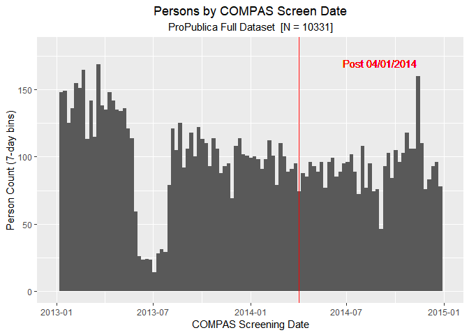

Figure 1: Persons by COMPAS Screen Date (7-day bins) - ProPublica Full
Dataset

Other than the very noticeable drop in COMPAS screen dates in mid-2013,
this graph appears reasonable.[14](#FN-14) The dates where
the mid-2013 drop occurs are in June and July 2013. It is not clear why
there is such a drop in COMPAS cases during these two months. I do not
address this issue in this paper. (To the extent this is a problem, it
appears to be a problem with the original dataset that ProPublica
received from Broward County since it is also evident in ProPublica’s
“compas-scores-raw.csv” dataset. So it does not appear to be a data
processing issue by ProPublica)[15](#FN-15)

To construct the two-year recidivism dataset(s), ProPublica presumably
wanted to keep people observed for at least two years at the end of the
time window for which it collected criminal history data, on April 1,
2016. As mentioned in the introduction, we should not have expected,
therefore, to see *anybody* in the two-year datasets with COMPAS
screening (or arrest) dates after 4/1/2014 (i.e. less than two years
prior to ProPublica’s data collection). However, as I show in the next
Figure, there are many people in the two-year dataset who do indeed have
a COMPAS screening (or arrest) date after this potential cutoff, all the
way through December 31, 2014 (which is the end date of the full
database).

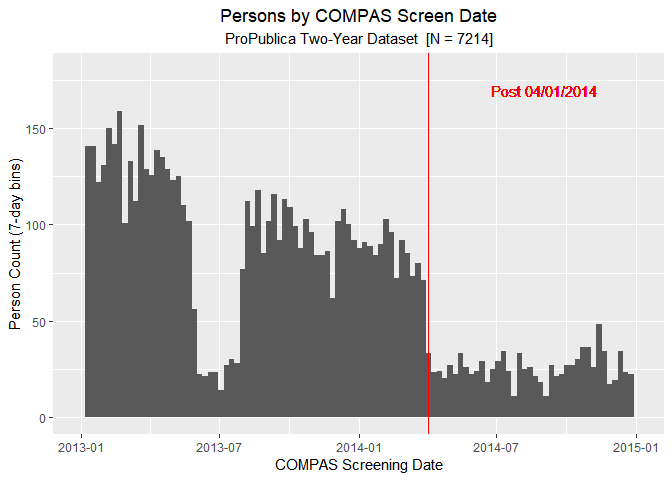

Figure 2: Persons by COMPAS Screen Date (7-day bins) - ProPublica
Two-Year Dataset

The potential two-year COMPAS screen cutoff mark is indicated by the red
vertical line on April 1, 2014. We clearly see that while the number of
people in the two-year (general recidivism) dataset drops substantially
after 4/1/2014, there are still non-trivial numbers of people after that
date. This is because, as mentioned above, there was an error in
ProPublica’s data processing used to create the two-year recidivism
datasets.

To create the two-year dataset, ProPublica used the following logic. You
either had your COMPAS screen date at least two years prior to
ProPublica’s data collection time. So two years prior to the end of
March 2016 (net of any jail and prison time). Or you could be in the
data for less than two years if you recidivated. Unfortunately, for the
latter, ProPublica did not use the cutoff of 4/1/2014 for the COMPAS
screen date. So this creates an unbalanced dataset with too many
recidivists. This is shown more clearly in the Figures below.

To see the data processing mistake more clearly, I now take a look at
these COMPAS screen dates separately for recidivists and
non-recidivists. I show first ProPublica’s full dataset, and then
ProPublica’s two-year general recidivism dataset. For ease of
comparison, I do this for the overall or any recidivism variable
(i.e. the “is\_recid” variable in ProPublica’s dataset; instead of the
“two\_year\_recid”
variable).[16](#FN-16)

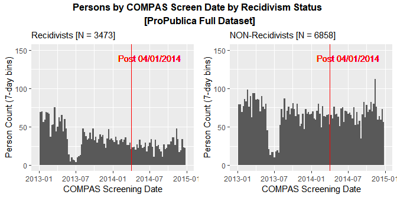

Figure 3: Persons by COMPAS Screen Date (7-day bins) by Recidivism
Status - ProPublica Full
Dataset

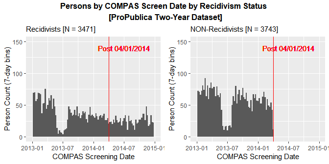

Figure 4: Persons by COMPAS Screen Date (7-day bins) by Recidivism
Status - ProPublica Two-Year Dataset

The graphs on the top panel are as expected. There is no real difference
in the pattern between recidivists and non-recidivists (other than the
overall level). The bottom panel graphs for the two-year dataset,
however, do show a stark difference between recidivists and
non-recidivists. We see that while ProPublica correctly dropped all
non-recidivists with COMPAS screening dates post 4/1/2014 in the
two-year dataset, it kept people with COMPAS screening dates after
4/1/2014 in that data if they recidivated. Indeed, in the Tables below
we see that the two-year recidivism dataset has almost exactly the same
number of people who recidivate at any point in time, as the full data
does, 3,471
vs. 3,473.[17](#FN-17)

<!-- I add table numbers manually to caption, to match figure numbers automatically created in pdf version -->

<!-- I could use bookdown instead, but bookdown has chapter number prefix in html version -->

<!-- So would not match continuous numbering in pdf version -->

<table>

<caption>

Table 1: Any Recidivism - ProPublica Full Dataset vs. ProPublica
Two-Year Dataset

</caption>

<thead>

<tr>

<th style="text-align:left;">

</th>

<th style="text-align:right;">

ProPublica Full Data

</th>

<th style="text-align:right;">

ProPublica 2-Yr Data

</th>

</tr>

</thead>

<tbody>

<tr>

<td style="text-align:left;">

0

</td>

<td style="text-align:right;">

6858

</td>

<td style="text-align:right;">

3743

</td>

</tr>

<tr>

<td style="text-align:left;">

1

</td>

<td style="text-align:right;">

3473

</td>

<td style="text-align:right;">

3471

</td>

</tr>

<tr>

<td style="text-align:left;">

Total

</td>

<td style="text-align:right;">

10331

</td>

<td style="text-align:right;">

7214

</td>

</tr>

</tbody>

</table>

If we look at a Table with recidivism status by the pre versus
post-April 1, 2014 COMPAS screen date indicator, we see that ProPublica
incorrectly kept almost one thousand extra recidivists in the two-year
general recidivism dataset.

<table class="table" style="margin-left: auto; margin-right: auto;">

<caption>

Table 2: Any Recidivism by Pre-Post April 1 2014 COMPAS screen date -
ProPublica Two-Year
Dataset

</caption>

<thead>

<tr>

<th style="border-bottom:hidden; padding-bottom:0; padding-left:3px;padding-right:3px;text-align: center; " colspan="1">

is\_recid

</th>

<th style="border-bottom:hidden; padding-bottom:0; padding-left:3px;padding-right:3px;text-align: center; " colspan="2">

post\_april\_2014

</th>

<th style="border-bottom:hidden" colspan="1">

</th>

</tr>

<tr>

<th style="text-align:left;">

</th>

<th style="text-align:right;">

0

</th>

<th style="text-align:right;">

1

</th>

<th style="text-align:right;">

Total

</th>

</tr>

</thead>

<tbody>

<tr>

<td style="text-align:left;">

0

</td>

<td style="text-align:right;border-left:1px solid;">

3743

</td>

<td style="text-align:right;">

0

</td>

<td style="text-align:right;border-left:1px solid;">

3743

</td>

</tr>

<tr>

<td style="text-align:left;">

1

</td>

<td style="text-align:right;border-left:1px solid;">

2473

</td>

<td style="text-align:right;">

998

</td>

<td style="text-align:right;border-left:1px solid;">

3471

</td>

</tr>

<tr>

<td style="text-align:left;">

Total

</td>

<td style="text-align:right;border-left:1px solid;">

6216

</td>

<td style="text-align:right;">

998

</td>

<td style="text-align:right;border-left:1px solid;">

7214

</td>

</tr>

</tbody>

</table>

The 998 recidivists who were incorrectly kept in the two-year (general
recidivism) data represent a 28.8% share of the 3,471 recidivists in
that dataset. Alternatively, we can say that ProPublica kept 998/2473 or
40.4% more recidivists than it should have. (And these shares are even
higher for the slightly smaller subset of two-year recidivists; see
Table 5 in the Recidivism Rates [Section](#recidivism-rates) below)
<!-- [Eventually may use bookdown package for cross-references)] -->

I construct a ***corrected*** version of the two-year general recidivism
dataset where I simply drop all people with a COMPAS screen date after
April 1, 2014, including recidivists.[18](#FN-18) In this
corrected dataset, I end up with the same number of non-recidivists as
in the ProPublica two-year dataset, but I have 998 fewer recidivists. If
we look at the COMPAS screening dates for this corrected dataset, we
have the
following:[19](#FN-19)

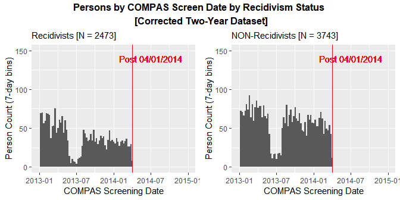

Figure 5: Persons by COMPAS Screen Date (7-day bins) by Recidivism
Status - Corrected Two-Year Dataset

The graph on the right-side panel, for non-recidivists, is exactly the
same as in the previous Figure. However, the graph on the left-side
panel, for recidivists, now correctly drops everyone with a COMPAS
screen date post-April 1, 2014.

# 4 Recidivism Rates

Here I will focus on the two-year recidivism variable. The COMPAS screen
date Figures above, split by recidivism status, were done using the
overall or any recidivism variable “is\_recid”, not the
“two\_year\_recid” variable, for comparison purposes to the full data.
As we see here, there are 220 more people with is\_recid=1 than
two\_year\_recid=1. These are people who recidivated, but did so after
more than two years after the original COMPAS screen date (but before
the end date of ProPublica criminal history data window at the end of
March 2016).

<table class="table" style="margin-left: auto; margin-right: auto;">

<caption>

Table 3: Any vs. Two-Year Recidivism - ProPublica Two-Year
Dataset

</caption>

<thead>

<tr>

<th style="border-bottom:hidden; padding-bottom:0; padding-left:3px;padding-right:3px;text-align: center; " colspan="1">

is\_recid

</th>

<th style="border-bottom:hidden; padding-bottom:0; padding-left:3px;padding-right:3px;text-align: center; " colspan="2">

two\_year\_recid

</th>

<th style="border-bottom:hidden" colspan="1">

</th>

</tr>

<tr>

<th style="text-align:left;">

</th>

<th style="text-align:right;">

0

</th>

<th style="text-align:right;">

1

</th>

<th style="text-align:right;">

Total

</th>

</tr>

</thead>

<tbody>

<tr>

<td style="text-align:left;">

0

</td>

<td style="text-align:right;border-left:1px solid;">

3743

</td>

<td style="text-align:right;">

0

</td>

<td style="text-align:right;border-left:1px solid;">

3743

</td>

</tr>

<tr>

<td style="text-align:left;">

1

</td>

<td style="text-align:right;border-left:1px solid;">

220

</td>

<td style="text-align:right;">

3251

</td>

<td style="text-align:right;border-left:1px solid;">

3471

</td>

</tr>

</tbody>

</table>

These 220 people represent only a 0.06 share of the 3,471 people who
recidivate in total. (These 220 people, by definition, all have COMPAS
dates before April 1, 2014) So the main findings of the data processing
error are similar for the overall or any recidivism variable and the
two-year recidivism variable. Either way, the bias in ProPublica’s
two-year recidivism datasets is clear: there is a disproportionate
number of recidivists.

This fundamental problem in dataset construction affects some statistics
more than others. It obviously has a substantial impact on the total
number of recidivists, and hence, also the share or rate of recidivism.
In particular, it *artificially inflates* the recidivism rate. The
artificially inflated two-year recidivism rate in ProPublica’s dataset
is the following:

<table class="table" style="margin-left: auto; margin-right: auto;">

<caption>

Table 4: Two-Year Recidivism Rate - ProPublica Two-Year
Dataset

</caption>

<thead>

<tr>

<th style="border-bottom:hidden; padding-bottom:0; padding-left:3px;padding-right:3px;text-align: center; " colspan="1">

two\_year\_recid

</th>

<th style="border-bottom:hidden; padding-bottom:0; padding-left:3px;padding-right:3px;text-align: center; " colspan="2">

Two-Year Recidivism

</th>

</tr>

<tr>

<th style="text-align:left;">

</th>

<th style="text-align:right;">

N

</th>

<th style="text-align:right;">

Rate

</th>

</tr>

</thead>

<tbody>

<tr>

<td style="text-align:left;">

0

</td>

<td style="text-align:right;border-left:1px solid;">

3963

</td>

<td style="text-align:right;">

0.549

</td>

</tr>

<tr>

<td style="text-align:left;">

1

</td>

<td style="text-align:right;border-left:1px solid;">

3251

</td>

<td style="text-align:right;">

0.451

</td>

</tr>

</tbody>

</table>

If we repeat the earlier Table 2, which displays recidivism status by
the post-April 1, 2014 COMPAS screen indicator, but now using the
two-year recidivism indicator instead of the overall or any recidivism
indicator (i.e. two\_year\_recid instead of is\_recid), we have the
following Table:

<table class="table" style="margin-left: auto; margin-right: auto;">

<caption>

Table 5: Two-Year Recidivism vs. Pre-Post April 1 2014 COMPAS screen
date - Two-Year
Data

</caption>

<thead>

<tr>

<th style="border-bottom:hidden; padding-bottom:0; padding-left:3px;padding-right:3px;text-align: center; " colspan="1">

two\_year\_recid

</th>

<th style="border-bottom:hidden; padding-bottom:0; padding-left:3px;padding-right:3px;text-align: center; " colspan="2">

post\_april\_2014

</th>

<th style="border-bottom:hidden" colspan="1">

</th>

</tr>

<tr>

<th style="text-align:left;">

</th>

<th style="text-align:right;">

0

</th>

<th style="text-align:right;">

1

</th>

<th style="text-align:right;">

Total

</th>

</tr>

</thead>

<tbody>

<tr>

<td style="text-align:left;">

0

</td>

<td style="text-align:right;border-left:1px solid;">

3963

</td>

<td style="text-align:right;">

0

</td>

<td style="text-align:right;border-left:1px solid;">

3963

</td>

</tr>

<tr>

<td style="text-align:left;">

1

</td>

<td style="text-align:right;border-left:1px solid;">

2253

</td>

<td style="text-align:right;">

998

</td>

<td style="text-align:right;border-left:1px solid;">

3251

</td>

</tr>

<tr>

<td style="text-align:left;">

Total

</td>

<td style="text-align:right;border-left:1px solid;">

6216

</td>

<td style="text-align:right;">

998

</td>

<td style="text-align:right;border-left:1px solid;">

7214

</td>

</tr>

</tbody>

</table>

The 998 recidivists who were incorrectly kept in ProPublica’s two-year
data represent a 30.7% share of the 3,251 people who recidivated within
two years in that dataset.[20](#FN-20) Alternatively, we can
say that ProPublica kept 998/2253 or 44.3% more two-year recidivists
than it should have.

<table class="table" style="margin-left: auto; margin-right: auto;">

<caption>

Table 6: Two-Year Recidivism Rate vs. Pre-Post April 1 2014 COMPAS
screen date - Two-Year
Data

</caption>

<thead>

<tr>

<th style="border-bottom:hidden; padding-bottom:0; padding-left:3px;padding-right:3px;text-align: center; " colspan="1">

two\_year\_recid

</th>

<th style="border-bottom:hidden; padding-bottom:0; padding-left:3px;padding-right:3px;text-align: center; " colspan="2">

post\_april\_2014

</th>

</tr>

<tr>

<th style="text-align:left;text-align: right;">

</th>

<th style="text-align:left;text-align: right;">

0

</th>

<th style="text-align:right;text-align: right;">

1

</th>

</tr>

</thead>

<tbody>

<tr>

<td style="text-align:left;">

0

</td>

<td style="text-align:left;border-left:1px solid;">

0.638

</td>

<td style="text-align:right;">

0.000

</td>

</tr>

<tr>

<td style="text-align:left;">

1

</td>

<td style="text-align:left;border-left:1px solid;">

0.362

</td>

<td style="text-align:right;">

1.000

</td>

</tr>

</tbody>

</table>

From these Tables, we see that the two-year recidivism rate is 45.1% in
ProPublica’s two-year data. We also see again that since ProPublica kept
recidivists (but did not keep non-recidivists) with COMPAS screen dates
post 4/1/14, all people with COMPAS screen dates post 4/1/2014 in the
two-year recidivism dataset are recidivists. Therefore, as shown on the
Table the correct two-year recidivism rate for the two-year data should
be 36.2%. But due to the sizable group of post 4/1/2014 recidivists that
ProPublica incorrectly kept, the two-year recidivism rate is
artificially inflated to 45.1%. So there is a difference of 8.8
percentage points,[21](#FN-21) and thus, the two-year
recidivism rate calculated by ProPublica is 24.3% higher than the true
rate.

To test whether the difference in the recidivism rates is statistically
significant, I compare the rate obtained with ProPublica’s two-year
dataset against the rate in the corrected two-year dataset, and
vice-versa. I use one-sample tests for this since these two datasets
(and the statistics calculated from them) are not independent samples. I
do two types of tests, a t-test, and a chi-squared test, which is more
appropriate for comparing proportions or rates. (The null hypothesis,
H0, in each case, is the mean recidivism rate in the other
dataset)[22](#FN-22)

<table>

<caption>

Table 7: Statistical Significance Tests: Recidivism Rate - ProPublica
vs. Corrected Two-Year Datasets

</caption>

<thead>

<tr>

<th style="text-align:left;">

</th>

<th style="text-align:left;">

N

</th>

<th style="text-align:left;">

Mean

</th>

<th style="text-align:left;">

SE

</th>

<th style="text-align:left;">

Low CI

</th>

<th style="text-align:left;">

Hi CI

</th>

<th style="text-align:left;">

Null Ho

</th>

<th style="text-align:left;">

t-stat

</th>

<th style="text-align:left;">

p-val.

</th>

<th style="text-align:left;">

chi-sq.

</th>

<th style="text-align:left;">

p-val.

</th>

</tr>

</thead>

<tbody>

<tr>

<td style="text-align:left;">

ProPub\_vs\_Correct

</td>

<td style="text-align:left;">

7214

</td>

<td style="text-align:left;">

0.451

</td>

<td style="text-align:left;">

0.006

</td>

<td style="text-align:left;">

0.439

</td>

<td style="text-align:left;">

0.462

</td>

<td style="text-align:left;">

0.362

</td>

<td style="text-align:left;">

15.06

</td>

<td style="text-align:left;">

2e-50

</td>

<td style="text-align:left;">

242.9

</td>

<td style="text-align:left;">

9e-55

</td>

</tr>

<tr>

<td style="text-align:left;">

Correct\_vs\_ProPub

</td>

<td style="text-align:left;">

6216

</td>

<td style="text-align:left;">

0.362

</td>

<td style="text-align:left;">

0.006

</td>

<td style="text-align:left;">

0.35

</td>

<td style="text-align:left;">

0.374

</td>

<td style="text-align:left;">

0.451

</td>

<td style="text-align:left;">

\-14.46

</td>

<td style="text-align:left;">

1e-46

</td>

<td style="text-align:left;">

195.3

</td>

<td style="text-align:left;">

2e-44

</td>

</tr>

</tbody>

</table>

Given the small standard errors of 0.006, the difference in the
recidivism rate (or the mean recidivism) between the two datasets, which
is 8.8 percentage points, is highly statistically significant (p-values
are very small, and hence, are displayed in scientific notation).

One can further examine the difference in the recidivism rates between
the two datasets for people across the COMPAS score (decile)
distribution. I do so in the next
Figure.

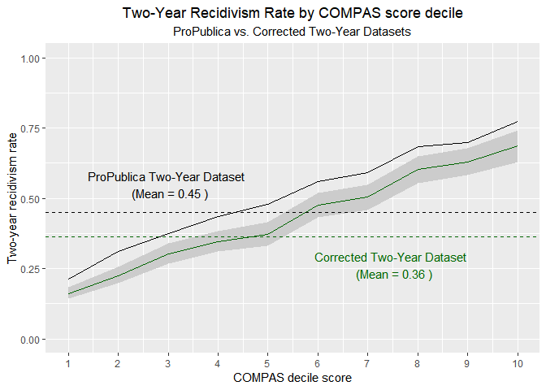

Figure 6: Two-Year Recidivism Rate by COMPAS score decile

As we see in this Figure, the two-year recidivism rate is clearly higher
for the ProPublica two-year dataset (black curve) than the corrected
dataset (dark green curve) at every COMPAS score decile. Moreover, this
difference is statistically significant at every decile (I show the
confidence interval for the corrected two-year data only since this
dataset and the ProPublica two-year dataset are not independent
datasets).

Another way of seeing ProPublica’s data processing mistake when creating
the two-year recidivism datasets is by doing a survival analysis. In the
[Appendix](#survival-analysis), I do such an analysis, and it confirms
the results presented here.

# 5 Confusion Matrix / Truth Tables

Here I explore how the data processing mistake impacts other results. In
particular, I look at the effect on the results from the contingency
table analysis performed by ProPublica. For this analysis, ProPublica
turned the COMPAS score categories of Low, Medium, and High, into a
binary classifier, grouping Medium and High scores into an overall High
score category.[23](#FN-23) I do the same here and report the
results obtained by ProPublica with its two-year recidivism dataset, and
the analogous set of results obtained using the corrected two-year
recidivism dataset.

<table>

<caption>

Table 8: ProPublica Two-Year Dataset: COMPAS Score Categories

</caption>

<thead>

<tr>

<th style="text-align:left;">

factor\_score\_text

</th>

<th style="text-align:right;">

Freq

</th>

</tr>

</thead>

<tbody>

<tr>

<td style="text-align:left;">

Low

</td>

<td style="text-align:right;">

3897

</td>

</tr>

<tr>

<td style="text-align:left;">

Medium

</td>

<td style="text-align:right;">

1914

</td>

</tr>

<tr>

<td style="text-align:left;">

High

</td>

<td style="text-align:right;">

1403

</td>

</tr>

<tr>

<td style="text-align:left;">

Total

</td>

<td style="text-align:right;">

7214

</td>

</tr>

</tbody>

</table>

<table>

<caption>

Table 9: ProPublica Two-Year Dataset: COMPAS Score Categories (Converted
to Binary)

</caption>

<thead>

<tr>

<th style="text-align:left;">

high\_score

</th>

<th style="text-align:right;">

Freq

</th>

</tr>

</thead>

<tbody>

<tr>

<td style="text-align:left;">

0

</td>

<td style="text-align:right;">

3897

</td>

</tr>

<tr>

<td style="text-align:left;">

1

</td>

<td style="text-align:right;">

3317

</td>

</tr>

<tr>

<td style="text-align:left;">

Total

</td>

<td style="text-align:right;">

7214

</td>

</tr>

</tbody>

</table>

<table class="table" style="margin-left: auto; margin-right: auto;">

<caption>

Table 10: ProPublica Two-Year Dataset Confusion Matrix: Recidivism
vs. Low/High COMPAS
Score

</caption>

<thead>

<tr>

<th style="border-bottom:hidden; padding-bottom:0; padding-left:3px;padding-right:3px;text-align: center; " colspan="1">

Actual  
two\_year\_recid

</th>

<th style="border-bottom:hidden; padding-bottom:0; padding-left:3px;padding-right:3px;text-align: center; " colspan="2">

Predicted   COMPAS Score

</th>

<th style="border-bottom:hidden" colspan="1">

</th>

</tr>

<tr>

<th style="text-align:left;">

</th>

<th style="text-align:right;">

Low

</th>

<th style="text-align:right;">

High

</th>

<th style="text-align:right;">

</th>

</tr>

</thead>

<tbody>

<tr>

<td style="text-align:left;">

0

</td>

<td style="text-align:right;border-left:1px solid;">

2681

</td>

<td style="text-align:right;">

1282

</td>

<td style="text-align:right;border-left:1px solid;">

0.55

</td>

</tr>

<tr>

<td style="text-align:left;">

1

</td>

<td style="text-align:right;border-left:1px solid;">

1216

</td>

<td style="text-align:right;">

2035

</td>

<td style="text-align:right;border-left:1px solid;">

0.45

</td>

</tr>

</tbody>

</table>

<table class="table" style="margin-left: auto; margin-right: auto;">

<caption>

Table 11: Corrected Two-Year Dataset: COMPAS Score Categories (Converted
to Binary)

</caption>

<thead>

<tr>

<th style="text-align:left;">

high\_score

</th>

<th style="text-align:right;">

Freq

</th>

</tr>

</thead>

<tbody>

<tr>

<td style="text-align:left;">

0

</td>

<td style="text-align:right;">

3522

</td>

</tr>

<tr>

<td style="text-align:left;">

1

</td>

<td style="text-align:right;">

2694

</td>

</tr>

<tr>

<td style="text-align:left;">

Total

</td>

<td style="text-align:right;">

6216

</td>

</tr>

</tbody>

</table>

<table class="table" style="margin-left: auto; margin-right: auto;">

<caption>

Table 12: Corrected Two-Year Dataset Confusion Matrix: Recidivism
vs. Low/High COMPAS
Score

</caption>

<thead>

<tr>

<th style="border-bottom:hidden; padding-bottom:0; padding-left:3px;padding-right:3px;text-align: center; " colspan="1">

Actual  
two\_year\_recid

</th>

<th style="border-bottom:hidden; padding-bottom:0; padding-left:3px;padding-right:3px;text-align: center; " colspan="2">

Predicted   COMPAS Score

</th>

<th style="border-bottom:hidden" colspan="1">

</th>

</tr>

<tr>

<th style="text-align:left;">

</th>

<th style="text-align:right;">

Low

</th>

<th style="text-align:right;">

High

</th>

<th style="text-align:right;">

</th>

</tr>

</thead>

<tbody>

<tr>

<td style="text-align:left;">

0

</td>

<td style="text-align:right;border-left:1px solid;">

2681

</td>

<td style="text-align:right;">

1282

</td>

<td style="text-align:right;border-left:1px solid;">

0.64

</td>

</tr>

<tr>

<td style="text-align:left;">

1

</td>

<td style="text-align:right;border-left:1px solid;">

841

</td>

<td style="text-align:right;">

1412

</td>

<td style="text-align:right;border-left:1px solid;">

0.36

</td>

</tr>

</tbody>

</table>

<table class="table" style="margin-left: auto; margin-right: auto;">

<caption>

Table 13: Confusion Matrix Results that are similar between ProPublica
vs. Corrected Two-Year Datasets

</caption>

<thead>

<tr>

<th style="text-align:left;">

</th>

<th style="text-align:right;">

</th>

<th style="text-align:right;">

Accuracy

</th>

<th style="text-align:right;">

FPR

</th>

<th style="text-align:right;">

FNR

</th>

</tr>

</thead>

<tbody>

<tr>

<td style="text-align:left;">

ProPublica\_results

</td>

<td style="text-align:right;">

7214

</td>

<td style="text-align:right;">

0.654

</td>

<td style="text-align:right;">

0.323

</td>

<td style="text-align:right;">

0.374

</td>

</tr>

<tr>

<td style="text-align:left;">

Corrected\_results

</td>

<td style="text-align:right;">

6216

</td>

<td style="text-align:right;">

0.658

</td>

<td style="text-align:right;">

0.323

</td>

<td style="text-align:right;">

0.373

</td>

</tr>

</tbody>

</table>

<table class="table" style="margin-left: auto; margin-right: auto;">

<caption>

Table 14: Confusion Matrix Results that are different between ProPublica
vs. Corrected Two-Year Datasets

</caption>

<thead>

<tr>

<th style="text-align:left;">

</th>

<th style="text-align:right;">

</th>

<th style="text-align:right;">

Prevalence

</th>

<th style="text-align:right;">

Pos Pred Value

</th>

<th style="text-align:right;">

Neg Pred Value

</th>

<th style="text-align:right;">

Detection Rate

</th>

</tr>

</thead>

<tbody>

<tr>

<td style="text-align:left;">

ProPublica\_results

</td>

<td style="text-align:right;">

7214

</td>

<td style="text-align:right;">

0.451

</td>

<td style="text-align:right;">

0.61

</td>

<td style="text-align:right;">

0.69

</td>

<td style="text-align:right;">

0.28

</td>

</tr>

<tr>

<td style="text-align:left;">

Corrected\_results

</td>

<td style="text-align:right;">

6216

</td>

<td style="text-align:right;">

0.362

</td>

<td style="text-align:right;">

0.52

</td>

<td style="text-align:right;">

0.76

</td>

<td style="text-align:right;">

0.23

</td>

</tr>

</tbody>

</table>

In the Tables above, I have replicated some of the results obtained by
ProPublica.[24](#FN-24) I also report the analogous results
using the corrected sample cutoff two-year recidivism dataset. In
addition to the prevalence of recidivism (i.e. the recidivism rate),
which we already discussed in the previous Recidivism Rates
[Section](#recidivism-rates), we see that the biased two-year dataset
used by ProPublica also affects the positive predictive value (PPV)
(which is often referred to as “precision”), the negative predictive
value (NPV), and the detection rate. In the corrected data, with the
lower prevalence of recidivism, not surprisingly, we see in the Table
above that PPV (and the detection rate) is lower and NPV is higher.
Northpointe focuses on the complements to PPV and NPV; i.e. 1 minus
these (see Dieterich et al. [2016](#ref-Northpointe_Report)). If we
focus on these complements instead, we see that with the biased
ProPublica two-year dataset a 0.39 (i.e. 1 - 0.61) share of people was
labeled high risk but did not re-offend, whereas with the corrected data
a 0.48 share of people is labeled high risk but does not re-offend. And
before a 0.31 share was labeled low risk but did re-offend, whereas now
a 0.24 share does so. Again, given the lower prevalence of recidivism in
the corrected data, it is not surprising that one type of error goes up
and the other goes down.

On the other hand, as we also see in the Tables above, the biased
dataset has relatively little impact on several other key statistics,
such as accuracy, the false positive rate (FPR), and the false negative
rate (FNR).[25](#FN-25) This is perhaps not that surprising.
The FPR is by definition independent of the actual number of positives
(or recidivists) in the data since it is the ratio of the number of
cases *predicted* to be positive (or to recidivate) but that are *not*
actually positive, over all the cases that are *not* positive. So the
FPR is calculated based only on actual negatives (i.e. only people who
do not recidivate). As a result, the FPR in the corrected two-year data
is *exactly* the same as the FPR in ProPublica’s two-year data.

At the same time, the FNR is only based on actual positives or people
who do recidivate. The FNR is the ratio of people who are *predicted*
not to recidivate but who actually recidivate, over all people who
recidivate. The total count of people who recidivate is clearly quite
different between the two datasets. However, as long as the COMPAS
scores of the additional recidivists who ProPublica incorrectly kept in
the two-year data is similar to the COMPAS scores of the recidivists who
are correctly kept in the two-year data, then this will have little
effect on the FNR. We see that this is indeed the case in the following
Table:

<table class="table" style="margin-left: auto; margin-right: auto;">

<caption>

Table 15: COMPAS Low/High Score vs. Pre-Post April 1 2014 COMPAS screen
date - Two-Year
Data

</caption>

<thead>

<tr>

<th style="border-bottom:hidden" colspan="1">

</th>

<th style="border-bottom:hidden; padding-bottom:0; padding-left:3px;padding-right:3px;text-align: center; " colspan="2">

Recidivists
Only

</th>

</tr>

<tr>

<th style="border-bottom:hidden; padding-bottom:0; padding-left:3px;padding-right:3px;text-align: center; " colspan="1">

High COMPAS
score

</th>

<th style="border-bottom:hidden; padding-bottom:0; padding-left:3px;padding-right:3px;text-align: center; " colspan="2">

post\_april\_2014

</th>

</tr>

<tr>

<th style="text-align:left;">

</th>

<th style="text-align:right;">

0

</th>

<th style="text-align:right;">

1

</th>

</tr>

</thead>

<tbody>

<tr>

<td style="text-align:left;">

0

</td>

<td style="text-align:right;border-left:1px solid;">

841

</td>

<td style="text-align:right;">

375

</td>

</tr>

<tr>

<td style="text-align:left;">

1

</td>

<td style="text-align:right;border-left:1px solid;">

1412

</td>

<td style="text-align:right;">

623

</td>

</tr>

<tr>

<td style="text-align:left;">

Total

</td>

<td style="text-align:right;border-left:1px solid;">

2253

</td>

<td style="text-align:right;">

998

</td>

</tr>

</tbody>

</table>

<table class="table" style="margin-left: auto; margin-right: auto;">

<caption>

Table 16: COMPAS Low/High Score vs. Pre-Post April 1 2014 COMPAS screen
date - Two-Year
Data

</caption>

<thead>

<tr>

<th style="border-bottom:hidden" colspan="1">

</th>

<th style="border-bottom:hidden; padding-bottom:0; padding-left:3px;padding-right:3px;text-align: center; " colspan="2">

Recidivists
Only

</th>

</tr>

<tr>

<th style="border-bottom:hidden; padding-bottom:0; padding-left:3px;padding-right:3px;text-align: center; " colspan="1">

High COMPAS
score

</th>

<th style="border-bottom:hidden; padding-bottom:0; padding-left:3px;padding-right:3px;text-align: center; " colspan="2">

post\_april\_2014

</th>

</tr>

<tr>

<th style="text-align:left;">

</th>

<th style="text-align:right;">

0

</th>

<th style="text-align:right;">

1

</th>

</tr>

</thead>

<tbody>

<tr>

<td style="text-align:left;">

0

</td>

<td style="text-align:right;border-left:1px solid;">

0.37

</td>

<td style="text-align:right;">

0.38

</td>

</tr>

<tr>

<td style="text-align:left;">

1

</td>

<td style="text-align:right;border-left:1px solid;">

0.63

</td>

<td style="text-align:right;">

0.62

</td>

</tr>

</tbody>

</table>

In this Table we see that the Low-High COMPAS score distribution is
almost identical for recidivists with COMPAS screen dates prior to the
two-year cutoff date of April 1, 2014, as it is for recidivists with
COMPAS screen dates after that date; the share of recidivists with a
high COMPAS score is 63% for the former, and 62% for the latter.
Therefore, it is not surprising that the FNR for the corrected two-year
dataset is almost identical to the FNR for ProPublica’s original
two-year dataset.[26](#FN-26)

Next, following ProPublica’s analysis, I repeat the confusion matrix
analysis separately for African-Americans and Caucasians (whom I label
blacks and whites, respectively, in the Tables below). This is the key
analysis that garnered the most attention when ProPublica’s article was
published, with a higher false positive rate
(FPR)<!-- NOTE_Writing_edit - this had a typo: FPV instead of FPR. I corrected this here -->
and a lower false negative rate (FNR) for blacks than whites. (I just
show the results here; the actual confusion matrix tables themselves are
in the [Appendix](#confusion-matrix-by-race-appendix))

<table>

<caption>

Table 17: Blacks: Confusion Matrix Results that are similar between
ProPublica vs Corrected Two-Year Data

</caption>

<thead>

<tr>

<th style="text-align:left;">

</th>

<th style="text-align:right;">

</th>

<th style="text-align:right;">

Accuracy

</th>

<th style="text-align:right;">

FPR

</th>

<th style="text-align:right;">

FNR

</th>

</tr>

</thead>

<tbody>

<tr>

<td style="text-align:left;">

ProPublica\_results\_blacks

</td>

<td style="text-align:right;">

3696

</td>

<td style="text-align:right;">

0.638

</td>

<td style="text-align:right;">

0.448

</td>

<td style="text-align:right;">

0.280

</td>

</tr>

<tr>

<td style="text-align:left;">

Corrected\_results\_blacks

</td>

<td style="text-align:right;">

3139

</td>

<td style="text-align:right;">

0.624

</td>

<td style="text-align:right;">

0.448

</td>

<td style="text-align:right;">

0.279

</td>

</tr>

</tbody>

</table>

<table>

<caption>

Table 18: Whites: Confusion Matrix Results that are similar between
ProPublica v Corrected Two-Year Data

</caption>

<thead>

<tr>

<th style="text-align:left;">

</th>

<th style="text-align:right;">

</th>

<th style="text-align:right;">

Accuracy

</th>

<th style="text-align:right;">

FPR

</th>

<th style="text-align:right;">

FNR

</th>

</tr>

</thead>

<tbody>

<tr>

<td style="text-align:left;">

ProPublica\_results\_whites

</td>

<td style="text-align:right;">

2454

</td>

<td style="text-align:right;">

0.670

</td>

<td style="text-align:right;">

0.235

</td>

<td style="text-align:right;">

0.477

</td>

</tr>

<tr>

<td style="text-align:left;">

Corrected\_results\_whites

</td>

<td style="text-align:right;">

2132

</td>

<td style="text-align:right;">

0.689

</td>

<td style="text-align:right;">

0.235

</td>

<td style="text-align:right;">

0.488

</td>

</tr>

</tbody>

</table>

<table>

<caption>

Table 19: Blacks: Confusion Matrix Results that do change between
ProPublica vs Corrected Two-Year Data

</caption>

<thead>

<tr>

<th style="text-align:left;">

</th>

<th style="text-align:right;">

</th>

<th style="text-align:right;">

Prevalence

</th>

<th style="text-align:right;">

Pos Pred Value

</th>

<th style="text-align:right;">

Neg Pred Value

</th>

<th style="text-align:right;">

Detection Rate

</th>

</tr>

</thead>

<tbody>

<tr>

<td style="text-align:left;">

ProPublica\_results\_blacks

</td>

<td style="text-align:right;">

3696

</td>

<td style="text-align:right;">

0.51

</td>

<td style="text-align:right;">

0.63

</td>

<td style="text-align:right;">

0.65

</td>

<td style="text-align:right;">

0.37

</td>

</tr>

<tr>

<td style="text-align:left;">

Corrected\_results\_blacks

</td>

<td style="text-align:right;">

3139

</td>

<td style="text-align:right;">

0.43

</td>

<td style="text-align:right;">

0.55

</td>

<td style="text-align:right;">

0.73

</td>

<td style="text-align:right;">

0.31

</td>

</tr>

</tbody>

</table>

<table>

<caption>

Table 20: Whites: Confusion Matrix Results that do change between
ProPublica vs Corrected Two-Year Data

</caption>

<thead>

<tr>

<th style="text-align:left;">

</th>

<th style="text-align:right;">

</th>

<th style="text-align:right;">

Prevalence

</th>

<th style="text-align:right;">

Pos Pred Value

</th>

<th style="text-align:right;">

Neg Pred Value

</th>

<th style="text-align:right;">

Detection Rate

</th>

</tr>

</thead>

<tbody>

<tr>

<td style="text-align:left;">

ProPublica\_results\_whites

</td>

<td style="text-align:right;">

2454

</td>

<td style="text-align:right;">

0.39

</td>

<td style="text-align:right;">

0.59

</td>

<td style="text-align:right;">

0.71

</td>

<td style="text-align:right;">

0.21

</td>

</tr>

<tr>

<td style="text-align:left;">

Corrected\_results\_whites

</td>

<td style="text-align:right;">

2132

</td>

<td style="text-align:right;">

0.30

</td>

<td style="text-align:right;">

0.49

</td>

<td style="text-align:right;">

0.78

</td>

<td style="text-align:right;">

0.15

</td>

</tr>

</tbody>

</table>

As expected from the discussion and combined race sample results
earlier, the FPR is identical, and the FNR is very similar, with the
corrected data, so blacks have a substantially higher FPR and lower FNR
than whites in the corrected data too. This key finding by ProPublica,
therefore, does not change with the corrected
data.[27](#FN-27)

The utility of focusing on the differences in the FPR and FNR across
race groups, however, has been called into question by other researchers
(see for example Corbett-Davies and Goel
[2018](#ref-2018arXiv180800023C)). Moreover, just like we saw with the
combined race sample, we see substantial differences in other
statistics. In particular, regarding recidivism prevalence, PPV, NPV,
and the detection rate.

# 6 Conclusion

While ProPublica’s COMPAS score and recidivism data are used in an
increasing number of studies to test various definitions and
methodologies of algorithmic fairness, researchers have taken the data
‘as is’ to test their methodologies, but have not examined closely the
data itself for data processing issues. This paper, instead of testing a
novel fairness definition or procedure, takes a closer look at the
actual datasets put together by ProPublica. In particular, the
sub-datasets built to study the likelihood of recidivism within two
years of the original offense arrest and COMPAS screening date.

I take a new yet simple approach to visualize these data, by analyzing
the distribution of defendants across COMPAS screening dates. Doing so,
I find that ProPublica made an important data processing mistake
creating these key datasets often used by other researchers. As I show
in this paper, ProPublica failed to implement a two-year sample cutoff
rule for recidivists (whereas it implemented an appropriate two-year
sample cutoff rule for non-recidivists). As a result, the bias in the
two-year dataset is clear, there are a disproportionate number of
recidivists. To my knowledge, this is the first paper to highlight this
key data processing mistake.

When I implement a simple two-year COMPAS screen date cutoff rule for
all people, including recidivists, I estimate that in the two-year
general recidivism dataset ProPublica kept 44.3% more two-year
recidivists than it should have. This fundamental problem in dataset
construction affects some statistics more than others. It obviously has
a substantial impact on the recidivism rate. In particular, it
artificially inflates the two-year general recidivism rate by 8.8
percentage points, from 36.2% to 45.1%, which represents a 24.3%
increase in the two-year recidivism rate.

ProPublica’s data processing mistake also affects the positive
predictive value (PPV) or precision, and the negative predictive value
(NPV). On the other hand, it has relatively little impact on several
other key statistics that are less susceptible to changes in the
relative share of recidivists versus non-recidivists, such as accuracy,
the false positive rate (FPR), and the false negative rate (FNR). While
the latter statistics, especially the differentials in the FPR and the
FNR by race, have garnered the most attention in the academic research
and public debate, the utility of focusing on those particular metrics
has been called into question by other researchers (see Corbett-Davies
and Goel [2018](#ref-2018arXiv180800023C)).

Ultimately, the practical importance of this data processing mistake may
be limited. I am not suggesting that Northpointe itself made a mistake
in actually developing the COMPAS recidivism risk score. While the data
used for that, and the actual model, are proprietary and not publicly
available; it is unlikely that a similar mistake was made when
developing such scores, or other recidivism risk scores by other
companies.[28](#FN-28) Although domain expertise does not
always translate into correctly processed data. For example,
Northpointe’s critique of ProPublica’s analysis, using ProPublica’s
COMPAS datasets (Dieterich et al. [2016](#ref-Northpointe_Report)),
fails to identify ProPublica’s data processing mistake, and thus,
produces some biased results. Or the rejoinder to ProPublica by two
criminal justice academics and a judicial system administrative officer,
who also do not identify the mistake in ProPublica’s data and hence
produce Figures where the two-year recidivism rate is biased upward
(Flores et al. [2016](#ref-Flores_et_al)). In any event, this paper puts
the focus on, and highlights the potential pitfalls in, the data
processing stage. I am currently working on a GitHub repository to make
public the corrected data, although the data correction is
straightforward and can be implemented by others
independently.[29](#FN-29)

<!-- =================================================================================== -->

<!-- =================================================================================== -->

# References

<!-- NOTE_Writing_edit -->

<!-- I use a different citations style here (which puts more active links to the cites) -->

<!-- I now use - csl: the-journal-of-real-estate-finance-and-economics.csl -->

<!-- Instead of - csl: american-statistical-association.csl -->

<!-- References look the same in body, but have active links in reference section -->

Angwin, J., Larson, J., Mattu, S., & Kirchner, L. (2016). Machine Bias.
There’s software used across the country to predict future criminals.
And it’s biased against blacks. *ProPublica*.
<https://www.propublica.org/article/machine-bias-risk-assessments-in-criminal-sentencing>

Barocas, S., & Selbst, A. D. (2016). Big data’s disparate impact.
*California Law Review*, *104*, 671.
<http://www.californialawreview.org/wp-content/uploads/2016/06/2Barocas-Selbst.pdf>

Bilal Zafar, M., Valera, I., Gomez Rodriguez, M., & Gummadi, K. P.
(2016). Fairness Beyond Disparate Treatment & Disparate Impact: Learning
Classification without Disparate Mistreatment. *arXiv e-prints*,
arXiv:1610.08452. <http://arxiv.org/abs/1610.08452>

Bilal Zafar, M., Valera, I., Gomez Rodriguez, M., Gummadi, K. P., &
Weller, A. (2017). From Parity to Preference-based Notions of Fairness
in Classification. *arXiv e-prints*, arXiv:1707.00010.
<http://arxiv.org/abs/1707.00010>

Chouldechova, A. (2016). Fair prediction with disparate impact: A study
of bias in recidivism prediction instruments. *arXiv e-prints*,
arXiv:1610.07524. <http://arxiv.org/abs/1610.07524>

Corbett-Davies, S., & Goel, S. (2018). The Measure and Mismeasure of
Fairness: A Critical Review of Fair Machine Learning. *arXiv e-prints*,
arXiv:1808.00023. <http://arxiv.org/abs/1808.00023>

Corbett-Davies, S., Pierson, E., Feller, A., Goel, S., & Huq, A. (2017).
Algorithmic decision making and the cost of fairness. *arXiv e-prints*,
arXiv:1701.08230. <http://arxiv.org/abs/1701.08230>

Cowgill, B. (2018). The Impact of Algorithms on Judicial Discretion:
Evidence from Regression Discontinuities. *Working Paper*.
<http://www.columbia.edu/~bc2656/papers/RecidAlgo.pdf>

Cowgill, B., & Tucker, C. E. (2019). Economics, fairness and algorithmic
bias. *SSRN Electronic Journal*.
<https://papers.ssrn.com/sol3/Papers.cfm?abstract_id=3361280>

Dieterich, W., Mendoza, C., & Brennan, T. (2016). COMPAS Risk Scales:
Demonstrating Accuracy Equity and Predictive Parity. *Northpointe Inc.*
<http://go.volarisgroup.com/rs/430-MBX-989/images/ProPublica_Commentary_Final_070616.pdf>

Flores, A. W., Bechtel, K., & Lowenkamp, C. T. (2016). False Positives,
False Negatives, and False Analyses: A Rejoinder to "Machine Bias:
There’s Software Used Across the Country to Predict Future Criminals.
And It’s Biased Against Blacks.". *Federal Probation Journal*, *80
Number 2*.
<https://www.uscourts.gov/federal-probation-journal/2016/09/false-positives-false-negatives-and-false-analyses-rejoinder>

Kleinberg, J., Ludwig, J., Mullainathan, S., & Rambachan, A. (2018).
Algorithmic fairness. *AEA Papers and Proceedings*, *108*, 22–27.
<http://www.aeaweb.org/articles?id=10.1257/pandp.20181018>

Larson, J., Mattu, S., Kirchner, L., & Angwin, J. (2016). How We
Analyzed the COMPAS Recidivism Algorithm. *ProPublica*.
<https://www.propublica.org/article/how-we-analyzed-the-compas-recidivism-algorithm>

Larson, J., Mattu, S., Kirchner, L., & Angwin, J. (2017). COMPAS
Analysis.jpynb. *ProPublica Jupyter Notebook on GitHub*.
<https://github.com/propublica/compas-analysis/blob/master/Compas%20Analysis.ipynb>

Rudin, C., Wang, C., & Coker, B. (2018). The age of secrecy and
unfairness in recidivism prediction. *arXiv e-prints*, arXiv:1811.00731.
<http://arxiv.org/abs/1811.00731>

<!-- =================================================================================== -->

<!-- =================================================================================== -->

# 7 Appendix

## 7.1 Full Dataset Drops

When creating the two-year recidivism datasets, ProPublica reduced the
full data sample for two reasons even before implementing its (faulty)
two-year cutoff. If we take the full dataset as a starting point, with
11,757 people, ProPublica for some reason dropped the last 756 person
IDs when constructing the two-year datasets. Starting from person ID
11002 to person ID 11757 in the full dataset. It is not clear why these
people were dropped. Many have COMPAS screen dates prior to 4/1/2014
since person IDs are not chronologically ordered. And thus, many of
these people are observed for two years or recidivate within two years.
In any case, I also dropped these 756 people in the construction of the
corrected two-year recidivism dataset, to make it as comparable as
possible to ProPublica’s 7,214 person two-year general recidivism
dataset (but for the explicit two-year COMPAS screen date cutoff
correction I implement).

Additionally, ProPublica also dropped 719 people who did not appear to
have good data. ProPublica could not find case/arrest information on
these people. ProPublica tagged these as “is\_recid = -1” in the full
dataset.[30](#FN-30) There is some overlap between the 756
people mentioned in the previous paragraph and these 719 people. So the
net additional drop in this step is actually 670 people. Thus, one ends
up with 10,331 people total in the ‘full’
dataset.[31](#FN-31) I also drop these 719 (or 670
*additional*) people in the construction of the corrected two-year
general recidivism dataset, so as to make it more comparable to
ProPublica’s two-year general recidivism dataset (again, but for the
explicit two-year COMPAS screen date cutoff correction).

## 7.2 Assumptions Regarding Data and Analysis

This paper’s key objective has been to point out the fundamental data
processing error made by ProPublica in the construction of its two-year
recidivism datasets. As such, I do not engage in a wholesale revision of
the ProPublica data and analysis. Therefore, I mostly take as given many
aspects of the data and analysis, and make many of the same assumptions
made by ProPublica and other researchers. (While I may revisit some of
these assumptions in future work, that is not the purpose of the current
paper) Therefore, I am otherwise assuming the data is generally in good
shape, and that the analytic approach is valid. However, here I list
some exceptions to this assumption regarding the quality of the data. I
also list the key assumptions made in the analysis.

> ### Data Assumptions

  - As with many data collection efforts that must obtain different
    features on a given sample from different data sources, and then
    match these, the matching is not perfect, and ProPublica
    acknowledges
this:

<!-- I added a font size command to html version, since otherwise indented text is very large in html -->

> >  “We found that sometimes people’s names or dates of
> > birth were incorrectly entered in some records – which led to
> > incorrect matches between an individual’s COMPAS score and his or
> > her criminal records. We attempted to determine how many records
> > were affected. In a random sample of 400 cases, we found an error
> > rate of 3.75 percent (CI: +/- 1.8 percent).” (Larson et al.
> > [2016](#ref-ProPublica_article_methods)) 

       I have not explored this data matching issue in my analysis.

  

  - Related to this matching issue, there are some people in its data
    who have multiple COMPAS screen dates. In calculations not
    shown,<!-- I will include this in separate program vvv --> I find
    there appear to be 688 people in the 11,757 person dataset with
    multiple COMPAS screen dates. ProPublica seems to have selected a
    single COMPAS screen date for such people when it builds the
    two-year dataset(s) (as well as its Cox datasets). I have not
    explored how it selected a single date. But since it is a relatively
    small share of people who have multiple COMPAS screen dates to begin
    with, this should not affect the main findings in my paper.

  - Also related to this, there are some people who ProPublica finds do
    not have good data. In particular, ProPublica says it could not find
    some key case and/or arrest information for these people. They total
    719 out of the 11,757 people in the full dataset or 6.1%. I also
    drop these people.[32](#FN-32)
    <!-- And mention how many would have been otherwise kept in two-year datasets. I will include this in separate program vvv -->

  - A very small number of people appear to have implausible *negative*
    time spells outside prison. In calculations not shown
    here,<!-- Cox data is used further below. So I will include this calculation in a separate program vvv -->
    I find that in the 11,757 person full dataset, only 63 people have
    such negative time spells. ProPublica adds these negative amounts
    (as negative) when calculating the total time outside of prison for
    such people. I do the same.

  - Some people have a “current” offense date that occurs a long time
    prior to the COMPAS screen date. However, the ‘jail\_in’ date for
    these people is close to the COMPAS screen date, so such people
    could plausibly have committed the offense a long time ago and only
    been caught/charged recently. So they do not necessarily represent a
    data problem.

  - ProPublica obtained criminal history information from the Broward
    County Clerk’s Office website, and jail records from the Broward
    County Sheriff’s Office, as well as public incarceration records
    from the Florida Department of Corrections website. I am not sure
    what happens if someone in ProPublica’s data sample moves away from
    Florida after the COMPAS screen date. In particular, it is not clear
    whether that person would show up in the data again if he or she
    commits a crime in a different state. I also do not know what
    happens if any of the people in the sample become deceased. There
    could be some sample attrition.

  - There are two months with very few people with COMPAS screen dates
    (June and July 2013).[33](#FN-33) It is not clear why
    there is such a drop in COMPAS cases during these two months. To the
    extent this is a problem, it appears to be a problem with the
    original dataset that ProPublica received from Broward County since
    it is also evident in the “compas-scores-raw.csv” dataset. So it
    does not appear to be a data processing issue by ProPublica. Thus,
    it is not clear what can be done about this (unless perhaps if one
    goes back to the original source in Broward County to try to collect
    the data again). In any event, I checked whether the relatively few
    people with COMPAS screen dates during these two months looked
    different in various dimensions, but they did not. (Except they did
    have a slightly longer period of time between the ‘jail\_in’ date
    and COMPAS screen date, with a mean of 3.3 days, compared to 0.6
    days for the rest of the data)

  - As I discuss in the first [section](#full-data-drops) of this
    Appendix, for some reason ProPublica dropped the people with the
    last 756 person IDs in its original pretrial defendants sample. It
    is not clear why it dropped these people. However, I also drop them
    for comparability to ProPublica’s analysis.

  - As other researchers note, some people in this dataset have low
    COMPAS scores and yet, surprisingly, have many prior offenses (Rudin
    et al. [2018](#ref-2018arXiv181100731R)). These researchers also
    note that on the flip-side, some people have high COMPAS scores, but
    no priors, and their current offense is non-violent (for this group,
    the researchers hypothesize that maybe ProPublica’s data is missing
    some criminal history information).

  - Finally, the age variable that ProPublica constructed is not quite
    accurate. ProPublica calculated age as the difference in years
    between the point in time when it collected the data, in early April
    2016, and the person’s date of birth. However, when studying
    recidivism, one should really use the age of the person at the time
    of the COMPAS screen date that starts the two-year time window. So
    some people actually may be up to two years younger than the age
    variable that ProPublica created. Since I do not really use age in
    any of my analyses, I do not take the trouble of correcting this
    variable.

> ### Analysis Assumptions

  - Since this analysis is for people in Broward County and for a
    particular point in time, it may not generalize to other
    jurisdictions and time windows.

  - In this paper, I have focused only on the two-year general
    recidivism dataset, and not the smaller dataset(s) that ProPublica
    created for the sub-category of two-year violent recidivism,
    although the latter suffers from the same data processing mistake as
    the two-year general recidivism dataset.[34](#FN-34)

  - The observed recidivism rate is really a re-arrest rate. It may not
    reflect the true recidivism rate in the sense that some people may
    commit new offenses but not get caught. (Clearly, therefore, the
    amount and aggressiveness of policing may affect the observed
    recidivism rate)

  - I focus on the study of the fixed time-period two-year recidivism
    outcome. With survival data, however, it is often preferable to
    apply survival models. Although, in the survival analysis
    [section](#survival-analysis) later in this Appendix, I show that at
    the two-year mark, the two approaches are almost identical (at least
    without controls). A survival analysis, nonetheless, gives a fuller
    picture of recidivism, since it is not constrained to a single point
    in time.

  - Foregoing the fuller picture provided by a survival analysis
    approach, for the most part, and doing an analysis of recidivism at
    a particular point in time instead, I am assuming that the two-year
    recidivism metric is the appropriate recidivism metric for this
    approach. (As opposed to, say, one-year recidivism, or three-year
    recidivism, etc.) ProPublica explains why it chose this particular
    time-frame, saying
it:

<!-- I added a font size command to html version, since otherwise indented text is very large in html -->

<!-- Have to close it after footnote, not before, otherwise get error. But footnote text size is fine -->

> >  “based this decision on Northpointe’s practitioners
> > guide, which says that its recidivism score is meant to predict ‘a
> > new misdemeanor or felony offense within two years of the COMPAS
> > administration date.’”[35](#FN-35) 

  - I am assuming that netting out prison (and jail) time served for the
    original offense, and only keeping non-recidivists who are observed
    for more than two-years outside of jail/prison is appropriate. This
    sub-setting seems reasonable, since clearly the recidivism rate may
    be quite different in prison than outside of prison.
    
    For consistency, one should also drop recidivists who only
    recidivate while in prison for their original offense. However, it
    does not appear that one can identify such recidivists readily from
    a feature in the data. Nevertheless, one could in principle estimate
    whether the recidivism offense date occurs during a time window when
    the person is in custody. Exploring this (in calculations not
    shown),<!-- I will include this in separate program (and also check for two_year_recid only) vvv -->
    I find that less than 2% of recidivists seem to commit a recidivism
    offense while in custody for their original offense. If one were to
    drop these recidivists, the two-year recidivism rate would drop
    further, but by less than 1 percentage point.
    
    Alternatively, to avoid most of the right-censoring due to prison
    time for the original offense, starting from the full dataset, one
    could potentially just keep all non-recidivists and recidivists
    whose COMPAS screen dates are prior to an “optimal” COMPAS screen
    cutoff date that is a non-trivial amount of time prior to the April
    1, 2014 cutoff, regardless of how much time they subsequently spend
    in jail or prison. (But still net out prison/jail time to construct
    the two-year recidivism indicator flag) This is potentially useful
    in order to have both recidivists and non-recidivists on a more
    equal footing. I explore this issue further
    [below](#optimal-cutoff).

  - In the analyses that utilize the COMPAS score, I am assuming that it
    is valid to study the COMPAS recidivism risk score for *pretrial*
    defendants. As Flores et al. ([2016](#ref-Flores_et_al)) point out,
    the recidivism risk score may actually be intended to be applied
    more to current prison inmates for probation decisions. (Indeed, the
    ProPublica data has a different set of COMPAS scores, regarding the
    risk of failure to appear in court, which may be intended for
    pretrial decisions instead. I have not explored this alternative
    COMPAS score)

  - I do not explore any feedback loop effects. As Cowgill points out
    and examines, judges sometimes use COMPAS scores to guide their
    *bail* decisions “and longer bailtime exerts a causal influence on
    defendants’ outcomes, including recidivism.” (Cowgill
    [2018](#ref-Cowgill_Recidivism))

  - The contingency table analyses assume that using a binary score
    category (Low vs. High) for the predictor variable is adequate. As
    opposed to a more detailed score breakdown, such as Low, Medium,
    High, or score deciles, or the continuous raw score. And that the
    breakpoint used, which groups deciles 1-4 and 5-10 into the two
    categories is appropriate (although I briefly examine different
    thresholds for the binary split of score deciles; see the ROC Curves
    Section [below](#ROC-curves)).

## 7.3 Survival Analysis

Another way of seeing ProPublica’s data processing mistake when making
the two-year recidivism datasets is by doing a survival analysis. In the
Figure below I graph the Kaplan-Meier survival curves for the full data,
the ProPublica two-year general recidivism data, and the corrected
two-year data. I use the overall or any recidivism variable “is\_recid”,
not the “two\_year\_recid” variable, here, so we can see the full curve,
even past two
years.[36](#FN-36)

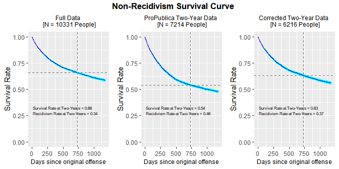

Figure 7: Non-Recidivism Survival Curves - Three Datasets

As we see from these graphs, at the two-year mark a 0.34 share of people
has recidivated in the full data. However, in ProPublica’s two-year
general recidivism data, at the two-year mark, a much higher fraction of
people recidivates after two years, 0.46. (This rate is almost identical
to the rate estimated in the Recidivism Rates
[Section](#recidivism-rates) above, 0.45). In the corrected two-year
data, at the two-year mark, a 0.37 share of the people has recidivated,
which is much closer to the full data estimate of
0.34.[37](#FN-37) (And is also almost identical to the rate
estimated for the corrected two-year data in the Recidivism Rates
[Section](#recidivism-rates) above, 0.36).[38](#FN-38)

## 7.4 Optimal COMPAS Screening Date Cutoff

Turning back now to the fixed time window two-year analysis, to avoid
right-censoring for non-recidivists due to prison time served for the
offense they committed just prior to their COMPAS screening (i.e. the
offense that led them to be jailed and screened, and perhaps later
convicted and imprisoned), one should really implement a COMPAS screen
sample cutoff date *earlier* than April 1, 2014. Indeed, ProPublica
already deals with this for non-recidivists in the two-year data, since
it nets out any jail/prison time they served for the original offense,
and only keeps non-recidivists observed for two years outside of
jail/prison. This is somewhat analogous to (but not exactly the same as)
implementing an earlier COMPAS screen-date cutoff (for non-recidivists).
(Of course, ProPublica implements no cutoff at all for recidivists)
Since ProPublica, therefore, drops non-recidivists with considerable
jail and/or prison time for their original offense, one should really
implement an overall COMPAS screen date cutoff (i.e. for recidivists
too) that is actually some non-trivial amount of time prior to April 1,
2014, to put recidivists and non-recidivists on a more equal
footing.[39](#FN-39)

This earlier COMPAS screen date cutoff is what I term the “optimal”
cutoff. Using the full dataset of 10,331 defendants before ProPublica’s
two-year drops, here I explore what the optimal cutoff date might be for
non-recidivists (but which would be applied across the board) that still
preserves the most data. In the next Figure, focusing only on
non-recidivists, I plot the fraction of people observed for two or more
years outside jail or prison by COMPAS screen
date.

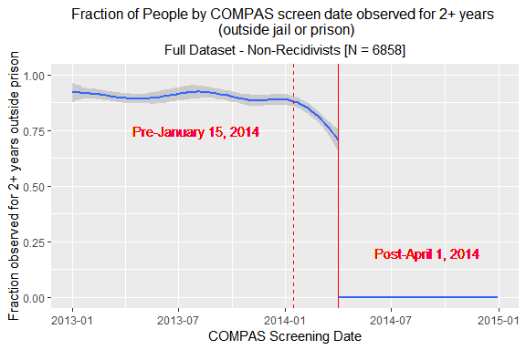

Figure 8: Exploring Optimal COMPAS Screening Date Cutoff for Two-Year
Recidivism Analysis

The solid red vertical line is, as always, on April 1, 2014. Clearly, as
expected, after April 1, 2014, the fraction of people by COMPAS screen
date observed for two or more years is zero. On the flip side, we see
that prior to sometime in January 2014, the vast majority of
non-recidivists are observed for two or more years outside jail or
prison. I plotted a dashed red line on January 15, 2014, as reference.
Between mid-January, 2014, and April 1, 2014, the fraction of
non-recidivists observed for two or more years declines substantially
(due to prison time served for the original offense) from approximately
88% to 71% (or 17 percentage points). However, prior to mid-January,
this fraction is flatter and only rises from 88% to 92% (or only 4
percentage points). So the most appropriate sample cutoff that still
preserves the most data appears to be sometime in early January,
2014.[40](#FN-40)

For simplicity in exposition (and comparability to ProPublica’s two-year
dataset), I have used the April 1, 2014 cutoff in most of this paper;
which already pinpoints all the issues with ProPublica’s two-year
dataset. Moreover, the corrected recidivism rate is almost identical if
one uses the April 1, 2014 cutoff, or an earlier January 2014 cutoff. If
I use a January 15, 2014 COMPAS screen cutoff date, the two-year general
recidivism rate is 36.3% instead of 36.2%. This is partly because any
additional time that is cut off from ProPublica’s two-year recidivism
dataset relative to April 1, 2014, will drop both recidivists and
non-recidivists (since ProPublica’s data processing mistake only
pertains to recidivists kept beyond April 1, 2014). To see this more
clearly, in the next Table I display the two-year recidivism rates in
the ProPublica two-year general recidivism dataset by COMPAS screen date
grouped into year-quarter combinations.

<table class="table" style="margin-left: auto; margin-right: auto;">

<caption>

Table 21: Two-Year Recidivism Rate vs. COMPAS screen date year-quarter -
ProPublica Two-Year
Data

</caption>

<thead>

<tr>

<th style="border-bottom:hidden; padding-bottom:0; padding-left:3px;padding-right:3px;text-align: center; " colspan="1">

two\_year\_recid

</th>

<th style="border-bottom:hidden; padding-bottom:0; padding-left:3px;padding-right:3px;text-align: center; " colspan="8">

Year-Quarter

</th>

</tr>

<tr>

<th style="text-align:left;">

</th>

<th style="text-align:left;">

2013.1

</th>

<th style="text-align:right;">

2013.2

</th>

<th style="text-align:right;">

2013.3

</th>

<th style="text-align:right;">

2013.4

</th>

<th style="text-align:right;">

2014.1

</th>

<th style="text-align:right;">

2014.2

</th>

<th style="text-align:right;">

2014.3

</th>

<th style="text-align:right;">

2014.4

</th>

</tr>

</thead>

<tbody>

<tr>

<td style="text-align:left;">

0

</td>

<td style="text-align:left;border-left:1px solid;">

0.616

</td>

<td style="text-align:right;">

0.646

</td>

<td style="text-align:right;">

0.645

</td>

<td style="text-align:right;">

0.647

</td>

<td style="text-align:right;">

0.648

</td>

<td style="text-align:right;">

0.009

</td>

<td style="text-align:right;">

0.000

</td>

<td style="text-align:right;">

0.000

</td>

</tr>

<tr>

<td style="text-align:left;">

1

</td>

<td style="text-align:left;border-left:1px solid;">

0.384

</td>

<td style="text-align:right;">

0.354

</td>

<td style="text-align:right;">

0.355

</td>

<td style="text-align:right;">

0.353

</td>

<td style="text-align:right;">

0.352

</td>

<td style="text-align:right;">

0.991

</td>

<td style="text-align:right;">

1.000

</td>

<td style="text-align:right;">

1.000

</td>

</tr>

</tbody>

</table>

As we see from the Table above, an earlier cutoff will not affect in any
meaningful way the results presented in the main body of this paper,
since the two-year recidivism rate fluctuates in a relatively narrow
band between 0.352 and 0.384 for people with COMPAS screen dates prior
to April 1, 2014.[41](#FN-41) For most COMPAS screen date
quarters the two-year recidivism rate actually fluctuates in a very
narrow band between 0.352 and 0.355. In the first quarter of 2013,
however, it is 0.384. It is not clear why the recidivism rate in this
quarter is non-trivially higher, but the difference is not very
large.[42](#FN-42) Moreover, given some likely underlying
exogenous variation or random noise in the data, we would not
necessarily have expected the recidivism rate to fluctuate in such an
otherwise narrow range. Finally, we might have actually expected the
recidivism rate to be slightly higher in the first quarter of *2014*
since as just mentioned ProPublica already dropped from this two-year
dataset non-recidivists with COMPAS screen dates prior to April 1, 2014,
who have non-trivial jail and/or prison time, and hence, are not
observed for a full two-years out of jail/prison. And this mostly
affects non-recidivists in the first quarter of 2014 per the previous
Figure. But in the first quarter of 2014, we observe a recidivism rate
that is almost identical to previous quarters (and is actually *lower*
than the first quarter of 2013). The fact that the recidivism rate for
the first quarter in 2014 is not slightly higher may reflect some
natural variability or noise in the data that is otherwise depressing
and cancelling this anticipated effect.[43](#FN-43)

## 7.5 ROC Curves

With a classification variable that has several possible threshold
values that one could use to turn it into a binary classifier, it is
common practice to plot the receiver-operating characteristic (ROC)
curve. The ROC plots the *sensitivity* (or 1 - FNR) against the
*specificity* (or 1 - FPR) for a variable turned into a binary
classifier, at various possible thresholds for the binary split. So far
in this paper, I have focused on the binary score split that ProPublica
used. ProPublica turned the COMPAS score categories of Low, Medium, and
High, into a binary classifier, grouping Medium and High scores into an
overall High score category. The initial mapping by Northpointe of the
underlying COMPAS score *deciles* to the Low, Medium, and High score
categories to begin with, is score deciles 1-4, 5-7, and 8-10,
respectively. Thus, for the further collapsed binary score where one
groups Medium and High scores into an overall High score category, the
decile mapping for Low vs. High scores is deciles 1-4 vs. 5-10. However,
one can explore all possible binary score breakpoints; e.g. score
deciles 1 vs. 2-10, 1-2 vs. 3-10, etc.[44](#FN-44)

The way to explore this is by plotting the ROC curve, as I do
here.[45](#FN-45) The area under the ROC curve (or the AUC)
gives a measure of how well the predictor variable performs in the
aggregate across all possible binary thresholds that one can use to
split it. The larger the area, the better the predictor (e.g. when
comparing two different predictor variables, or alternatively, the same
predictor on two different datasets). In the Figure below, I plot the
ROC curves for the ProPublica versus corrected two-year
datasets.

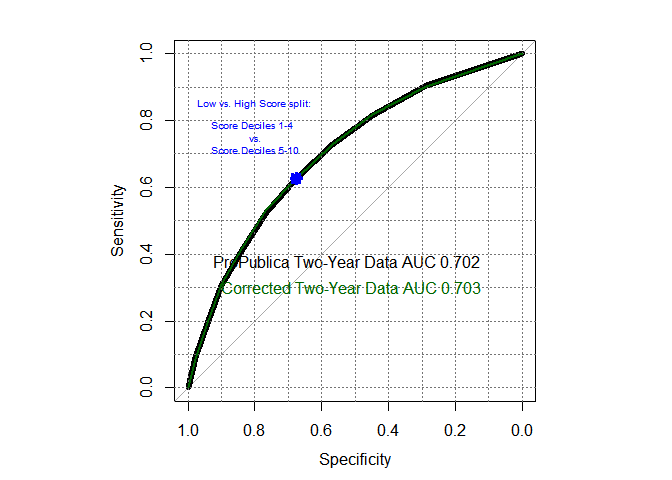

Figure 9: ROC curves for Two-Year Recidivism using COMPAS score deciles

As we can see from this Figure, the ROC curves for the two datasets are
essentially identical, lying on top of one another (the ROC curve for
ProPublica’s two-year data is in black, and the ROC curve for the
corrected data is in dark green). This is not that surprising given our
earlier results in the Confusion Matrix [Section](#confusion-matrix),
where we saw that the false positive rate is identical, and the false
negative rate is very similar, across the two datasets (for the
particular score decile split - deciles 1-4 vs. 5-10 - used there; which
is indicated on this Figure by the blue dot mark). As discussed in that
earlier section, the FPR is by definition independent of the actual
number of positives (or recidivists) in the data; so it is identical in
both datasets. At the same time, the FNR is only based on actual
positives or people who do recidivate. While the total count of people
who recidivate is clearly quite different between the two datasets,
since the COMPAS scores of the *additional* recidivists who ProPublica
incorrectly kept in the two-year data are similar to the COMPAS scores
of the recidivists who are correctly kept in both datasets, then the FNR
is very similar.

## 7.6 Confusion Matrix - Additional Results by Race

Focusing again on the score decile split analyzed in the main body of
the paper, i.e. score deciles 1-4 vs. 5-10, at the end of the Confusion
Matrix [Section](#confusion-matrix), we showed the confusion matrix
analysis results separately by race. However, for ease of exposition, we
did not show the actual confusion matrix contingency tables by race
there. We do so here.

<table class="table" style="margin-left: auto; margin-right: auto;">

<caption>

Table 22: Blacks ProPublica Two-Year Dataset Confusion Matrix:
Recidivism vs. Low/High COMPAS
Score

</caption>

<thead>

<tr>

<th style="border-bottom:hidden; padding-bottom:0; padding-left:3px;padding-right:3px;text-align: center; " colspan="1">

Actual  
two\_year\_recid

</th>

<th style="border-bottom:hidden; padding-bottom:0; padding-left:3px;padding-right:3px;text-align: center; " colspan="2">

Predicted   COMPAS Score

</th>

<th style="border-bottom:hidden" colspan="1">

</th>

</tr>

<tr>

<th style="text-align:left;">

</th>

<th style="text-align:right;">

Low

</th>

<th style="text-align:right;">

High

</th>

<th style="text-align:right;">

</th>

</tr>

</thead>

<tbody>

<tr>

<td style="text-align:left;">

0

</td>

<td style="text-align:right;border-left:1px solid;">

990

</td>

<td style="text-align:right;">

805

</td>

<td style="text-align:right;border-left:1px solid;">

0.49

</td>

</tr>

<tr>

<td style="text-align:left;">

1

</td>

<td style="text-align:right;border-left:1px solid;">

532

</td>

<td style="text-align:right;">

1369

</td>

<td style="text-align:right;border-left:1px solid;">

0.51

</td>

</tr>

</tbody>

</table>

<table class="table" style="margin-left: auto; margin-right: auto;">

<caption>

Table 23: Whites ProPublica Two-Year Dataset Confusion Matrix:
Recidivism vs. Low/High COMPAS
Score

</caption>

<thead>

<tr>

<th style="border-bottom:hidden; padding-bottom:0; padding-left:3px;padding-right:3px;text-align: center; " colspan="1">

Actual  
two\_year\_recid

</th>

<th style="border-bottom:hidden; padding-bottom:0; padding-left:3px;padding-right:3px;text-align: center; " colspan="2">

Predicted   COMPAS Score

</th>

<th style="border-bottom:hidden" colspan="1">

</th>

</tr>

<tr>

<th style="text-align:left;">

</th>

<th style="text-align:right;">

Low

</th>

<th style="text-align:right;">

High

</th>

<th style="text-align:right;">

</th>

</tr>

</thead>

<tbody>

<tr>

<td style="text-align:left;">

0

</td>

<td style="text-align:right;border-left:1px solid;">

1139

</td>

<td style="text-align:right;">

349

</td>

<td style="text-align:right;border-left:1px solid;">

0.61

</td>

</tr>

<tr>

<td style="text-align:left;">

1

</td>

<td style="text-align:right;border-left:1px solid;">

461

</td>

<td style="text-align:right;">

505

</td>

<td style="text-align:right;border-left:1px solid;">

0.39

</td>

</tr>

</tbody>

</table>

<table class="table" style="margin-left: auto; margin-right: auto;">

<caption>

Table 24: Blacks Corrected Two-Year Dataset Confusion Matrix: Recidivism
vs. Low/High COMPAS
Score

</caption>

<thead>

<tr>

<th style="border-bottom:hidden; padding-bottom:0; padding-left:3px;padding-right:3px;text-align: center; " colspan="1">

Actual  
two\_year\_recid

</th>

<th style="border-bottom:hidden; padding-bottom:0; padding-left:3px;padding-right:3px;text-align: center; " colspan="2">

Predicted   COMPAS Score

</th>

<th style="border-bottom:hidden" colspan="1">

</th>

</tr>

<tr>

<th style="text-align:left;">

</th>

<th style="text-align:right;">

Low

</th>

<th style="text-align:right;">

High

</th>

<th style="text-align:right;">

</th>

</tr>

</thead>

<tbody>

<tr>

<td style="text-align:left;">

0

</td>

<td style="text-align:right;border-left:1px solid;">

990

</td>

<td style="text-align:right;">

805

</td>

<td style="text-align:right;border-left:1px solid;">

0.57

</td>

</tr>

<tr>

<td style="text-align:left;">

1

</td>

<td style="text-align:right;border-left:1px solid;">

375

</td>

<td style="text-align:right;">

969

</td>

<td style="text-align:right;border-left:1px solid;">

0.43

</td>

</tr>

</tbody>

</table>

<table class="table" style="margin-left: auto; margin-right: auto;">

<caption>

Table 25: Whites Corrected Two-Year Dataset Confusion Matrix: Recidivism
vs. Low/High COMPAS
Score

</caption>

<thead>

<tr>

<th style="border-bottom:hidden; padding-bottom:0; padding-left:3px;padding-right:3px;text-align: center; " colspan="1">

Actual  
two\_year\_recid

</th>

<th style="border-bottom:hidden; padding-bottom:0; padding-left:3px;padding-right:3px;text-align: center; " colspan="2">

Predicted   COMPAS Score

</th>

<th style="border-bottom:hidden" colspan="1">

</th>

</tr>

<tr>

<th style="text-align:left;">

</th>

<th style="text-align:right;">

Low

</th>

<th style="text-align:right;">

High

</th>

<th style="text-align:right;">

</th>

</tr>

</thead>

<tbody>

<tr>

<td style="text-align:left;">

0

</td>

<td style="text-align:right;border-left:1px solid;">

1139

</td>

<td style="text-align:right;">

349

</td>

<td style="text-align:right;border-left:1px solid;">

0.7

</td>

</tr>

<tr>

<td style="text-align:left;">

1

</td>

<td style="text-align:right;border-left:1px solid;">

314

</td>

<td style="text-align:right;">

330

</td>

<td style="text-align:right;border-left:1px solid;">

0.3

</td>

</tr>

</tbody>

</table>

## 7.7 Correcting Recidivism Figures in Other Papers

Finally, here I replicate some Figures in prior papers by other
researchers who have used ProPublica’s COMPAS two-year dataset(s), and
whose Figures therefore display two-year recidivism rates that are
biased upward. While the *relative* patterns they show (e.g. across race
or sex) remain qualitatively similar, the levels are off. First, in the
next two Figures, I replicate Figure 2 in Corbett-Davies et al.
([2017](#ref-2017arXiv170108230C)) and then Figure 1 in Chouldechova
([2016](#ref-2016arXiv161007524C)). Both of these Figures show the
two-year recidivism rate by COMPAS score decile by race (for
African-Americans and Caucasians only), but do so in a different format
and style.

Here, and in the remaining Figures, I show the original Figures using
ProPublica’s two-year dataset on the left-hand side panels, and then on
the right-hand side panels what the Figures look like using the
corrected two-year dataset that drops everyone with a COMPAS screen date
post April 1, 2014. I try to replicate Figures as closely as possible to
what they look like in the original
publications.[46](#FN-46)

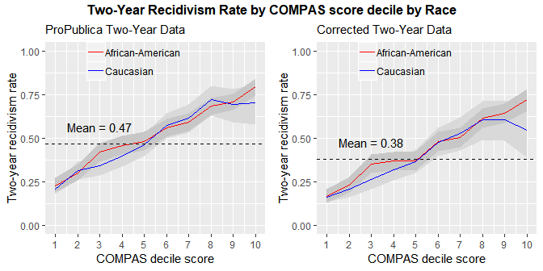

Figure 10: Two-Year Recidivism Rate by COMPAS score by Race (replicating
Corbett-Davies et
al. 2017)

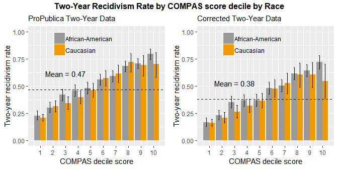

Figure 11: Two-Year Recidivism Rate by COMPAS score by Race (replicating
Chouldechova 2016)

Next, I replicate a Figure by some of the same authors as the first
Figure I replicated above, this time depicting the two-year recidivism
rate by COMPAS score decile *by sex* (see Corbett-Davies and Goel
([2018](#ref-2018arXiv180800023C)); this is Figure 1 in their paper).
Since I have not previously shown the data breakdown by sex in this
paper, I first include a Table with this information.

<table>

<caption>

Table 26: Sex - ProPublica and Corrected Two-Year
Data

</caption>

<thead>

<tr>

<th style="text-align:left;">

</th>

<th style="text-align:right;">

ProPublica

</th>

<th style="text-align:right;">

Corrected

</th>

</tr>

</thead>

<tbody>

<tr>

<td style="text-align:left;">

Female

</td>

<td style="text-align:right;">

1395

</td>

<td style="text-align:right;">

1213

</td>

</tr>

<tr>

<td style="text-align:left;">

Male

</td>

<td style="text-align:right;">

5819

</td>

<td style="text-align:right;">

5003

</td>

</tr>

<tr>

<td style="text-align:left;">

Total

</td>

<td style="text-align:right;">

7214

</td>

<td style="text-align:right;">

6216

</td>

</tr>

</tbody>

</table>

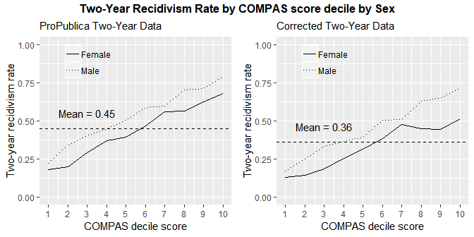

Figure 12: Two-Year Recidivism Rate by COMPAS score by Sex (replicating
Corbett-Davies and Goel 2018)

Finally, I replicate a Figure in the analysis done by
DistrictDataLabs.[47](#FN-47) This Figure depicts the COMPAS
score decile distribution by two-year recidivism status. (Figures are
not numbered in their
analysis)

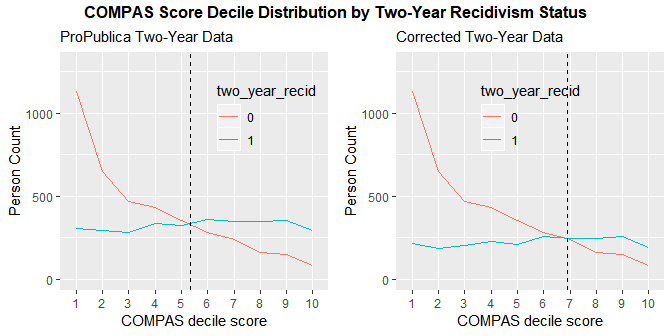

Figure 13: COMPAS Score Decile Distribution by Two-Year Recidivism
Status (replicating DistrictDataLabs)

In the last Figure I added a vertical dashed line in my paper (and in
the previous Figures I added a horizontal dashed line). This vertical
line in the last Figure is where the two curves in that Figure cross.
That is the score at which there begin to be more recidivists than
non-recidivists. This occurs at a (decile) average score slightly above
5 (around 5.34) in the ProPublica two-year dataset. But it occurs at a
substantially higher (decile) average score of almost 7 (around 6.9) in
the corrected two-year dataset. This is because there are fewer
recidivists in the corrected
data.[48](#FN-48)

<!-- =================================================================================== -->

<!-- =================================================================================== -->

## Footnotes

1.  First version on arXiv: **June 11**, 2019. E-mail:
    <mbarenstein@gmail.com>. The author is a staff economist at the
    Federal Trade Commission (FTC). This study was conducted
    independently of his work at the FTC. The views expressed in this
    article are those of the author. They do not necessarily represent
    those of the Federal Trade Commission or any of its Commissioners. I
    thank Federico Echenique for his comments on this paper.

2.  See also a seminal paper in this literature by Barocas and Selbst
    ([2016](#ref-barocas2016big)).

3.  A private company, Northpointe Inc. (now Equivant), developed the
    COMPAS recidivism risk scores. COMPAS is short for Correctional
    Offender Management Profiling for Alternative Sanctions.

4.  Except for Rudin et al. ([2018](#ref-2018arXiv181100731R)), who
    reconstruct datasets from the original ProPublica Python database
    “partly to ensure the quality of the features and partly to create
    new features.” (p.32) While in so doing they may have avoided making
    the same data processing mistake that ProPublica makes, they do not
    generally highlight the dataset differences between their data and
    ProPublica’s and do not identify ProPublica’s data processing
    mistake. Their focus is altogether different, as they attempt to
    reverse engineer the COMPAS recidivism risk scores, to understand
    how Northpointe builds those scores.

5.  It is not clear whether ProPublica intended to actually process the
    data this way, in which case it is a conceptual mistake, or whether
    it did not intend to use this faulty logic, in which case it is a
    data processing mistake. In either case, it leads to the same biased
    sample two-year datasets.

6.  Or one minus these rates, i.e. specificity and sensitivity. Note
    that the FPR, and hence, also specificity, are by definition
    independent of the actual number of positives (or recidivists) in
    the data. They are calculated based only on actual negatives
    (i.e. only people who do *not* recidivate). So these statistics
    remain unchanged when I implement a two-year sample cutoff on
    recidivists.

7.  The COMPAS survey contains over 130 questions; part of the survey is
    based on administrative data (Cowgill
    [2018](#ref-Cowgill_Recidivism)).

8.  In ProPublica’s COMPAS data 69% of defendants appear to be
    administered the COMPAS survey the same day or one day after they
    are jailed.

9.  The set of more than 11 thousand pretrial defendants is what I call
    the *full* dataset. It has 11,757 people. (I also call the slightly
    smaller set of 10,331 people the *full* dataset; this second variant
    of the full dataset is reduced due to the full dataset trimming done
    by ProPublica, which I describe in the [Appendix](#full-data-drops))

10. ProPublica obtained criminal history information (both before and
    after the COMPAS screen date) for this sample of COMPAS pretrial
    defendants from public criminal records on the Broward County
    Clerk’s Office website through April 1, 2016. It also obtained
    jail records from the Broward County Sheriff’s Office from January
    2013 to April 2016 and downloaded public incarceration records from
    the Florida Department of Corrections website.

11. The location of the ProPublica data on the Web is at
    <https://github.com/propublica/compas-analysis>.

12. That file does not contain some key information in other datasets,
    such as any prison time served for the original crime if convicted,
    which is necessary to calculate whether the person was free (outside
    prison) for at least two years, and thus, it does not have a flag
    for two-year recidivism.

13. In addition to the distinction between general and violent
    recidivism, I sometimes draw a distinction between ‘overall’ or
    ‘any’ recidivism versus two-year recidivism. This distinction is
    not based on the type of offense committed, but rather on the timing
    of the offense, as I explain in the next section.

14. Also noticeable is the generally higher number of COMPAS screen
    dates in the first half of 2013.

15. I checked whether the relatively few people with COMPAS screen dates
    during these two months looked different than the rest of the data,
    along various dimensions, but they generally did not, except they
    did have somewhat longer times between the arrest date and COMPAS
    screen date; see [Appendix](#assumptions).

16. I do not use two-year recidivism here since the full dataset does
    not have a two-year recidivism flag. As we see in the Recidivism
    Rates [Section](#recidivism-rates) below, there are 220 people who
    have the overall “is\_recid” flag turned on, but not the
    “two\_year\_recid” flag. These are people who recidivated but did
    so after more than two years after the original COMPAS screen date,
    but before the end date of ProPublica criminal history data window,
    at the end of March 2016. These 220 people represent only a 0.06
    share of the 3,471 people who recidivate in total.

17. The difference of 2 people is because these 2 people have a value of
    “N/A” for the COMPAS score category, and ProPublica drops these from
    the two-year recidivism datasets.

18. To avoid right-censoring due to jail and/or prison time served for
    the original offense, one should perhaps implement an even earlier
    COMPAS screen date sample cutoff. Although ProPublica already dealt
    with this issue (for non-recidivists). I discuss the optimal cutoff
    further in the [Appendix](#optimal-cutoff). In any case, the results
    presented here with the April 1, 2014 cutoff are robust to using an
    earlier (optimal) cutoff instead. Therefore, for simplicity in
    exposition and comparability to ProPublica’s two-year dataset, I use
    the April 1, 2014 cutoff.

19. Again, for comparison to the full data Figures displayed earlier, I
    do this for the overall or any recidivism variable (i.e. the
    “is\_recid” variable in ProPublica’s dataset; instead of the
    “two\_year\_recid” variable).

20. This 998 total is the same as before since by definition all the
    people with is\_recid = 1 who have COMPAS screen dates after April
    1, 2014, also have two\_year\_recid = 1 (since April 1, 2014, is
    less than two years before the end of the data window in late March
    2016).

21. While the difference of the rounded recidivism percent rates is 8.9
    percentage points, with less rounding the respective rates are
    45.07% and 36.25%, and hence, the actual difference is 8.82
    percentage points, which is rounded to 8.8 percentage points.

22. I report results for two-sided tests, although one could in
    principle do one-sided tests here. Those would be even more
    statistically significant.

23. The initial mapping by Northpointe of COMPAS score *deciles* to Low,
    Medium, and High is score deciles 1-4, 5-7, and 8-10, respectively.
    Thus, for the further collapsed binary score where one groups Medium
    and High scores into an overall High score category, the decile
    mapping for Low vs. High scores is deciles 1-4 vs. 5-10.

24. In particular, those reported in item (51) in their GitHub Jupyter
    notebook (Larson et al. [2017](#ref-ProPublica_Jupyter)). Although
    the accuracy and detection rates are not reported by ProPublica.

25. Or one minus these rates, i.e. specificity and sensitivity.

26. This similarity in the FNRs, combined with identical FPRs as we saw
    previously, means that there is also very little impact on the
    receiver-operating characteristic (ROC) curve and the area under
    that curve; see [Appendix](#ROC-curves).

27. Here again, note that accuracy (and the detection rate) was not
    reported by ProPublica. The lack of reporting for accuracy,
    especially in these by-race results, is one of Northpointe’s main
    critiques of ProPublica’s analysis since the accuracy is similar for
    blacks and whites (Dieterich et al.
    [2016](#ref-Northpointe_Report)).

28. Moreover, it is not clear to what extent a recidivism risk score is
    used by judges at the *pretrial* stage to set bail. Although Cowgill
    using the ProPublica COMPAS data finds a non-trivial effect at score
    class breakpoints (Cowgill [2018](#ref-Cowgill_Recidivism)). (I am
    not sure if Cowgill corrected the data processing issue highlighted
    in this paper when doing his analysis, and if doing so would have
    any impact on his results)

29. Additionally, Rudin et al. ([2018](#ref-2018arXiv181100731R)) have
    also reconstructed the ProPublica COMPAS datasets from the original
    ProPublica Python database and made them available on GitHub. In so
    doing they may have avoided making the same data processing mistake
    as ProPublica. (Although they do not generally highlight the dataset
    differences between their dataset and ProPublica’s, and do not
    identify ProPublica’s data processing mistake. As mentioned earlier,
    their focus is altogether different)

30. Interestingly, ProPublica dropped these people from the two-year
    general recidivism dataset. But it did not drop them from the
    two-year *violent* recidivism dataset. (While it did drop them from
    the more reduced 4,743 two-year violent csv file, it did not drop
    them in the 6,454 two-year violent data it used for the violent
    recidivism truth tables)

31. This is also the same number of people as in ProPublica’s Cox
    general recidivism dataset “cox-parsed.csv”.

32. As discussed in the first [section](#full-data-drops) of this
    Appendix, ProPublica tagged these as “is\_recid = -1” in the full
    dataset.

33. Also noticeable is the higher number of COMPAS screen dates in the
    first half of 2013.

34. ProPublica did not actually make readily available the two-year
    violent recidivism csv file it uses for its key violent recidivism
    analysis. But it can be reconstructed. The even more reduced
    two-year violent recidivism csv file ProPublica did make available,
    which it uses only in certain parts of its analyses, has the further
    problem that it drops people who are non-violent recidivists
    entirely (instead of tagging them as non-recidivists for violent
    offenses).

35. ProPublica also points to “a (recent)
    [study](https://www.ussc.gov/research/research-reports/recidivism-among-federal-offenders-comprehensive-overview)
    of 25,000 federal prisoners’ recidivism rates by the U.S. Sentencing
    Commission, which shows that most recidivists commit a new crime
    within the first two years after release (if they are going to
    commit a crime at all).”

36. As we saw in the Recidivism Rates [Section](#recidivism-rates)
    above, in the two-year datasets there are 220 more people with
    is\_recid=1 than two\_year\_recid=1. These are people who
    recidivated, but did so more than two years after the original
    COMPAS date (but before the end date of ProPublica’s criminal
    history data window at the end of March 2016).

37. The slight difference between the corrected two-year data and the
    full data is due to the sample composition difference. The corrected
    two-year data does not contain any people with COMPAS dates
    post-April 1, 2014, so we shouldn’t expect the rates to be exactly
    the same.

38. If we use three digits after the decimal point, the recidivism rates
    estimated in the survival analysis are as follows, 0.342, 0.459, and
    0.368, for the full dataset, the ProPublica two-year dataset, and
    the corrected two-year dataset, respectively. For comparison, in the
    Recidivism Rates [Section](#recidivism-rates) earlier, the last two
    rates were 0.451 and 0.362, respectively. So the survival analysis
    results are almost identical to the results in that earlier section.

39. As noted in the assumptions [section](#assumptions) earlier in this
    Appendix, to really treat them equally, one should further drop any
    recidivists who recidivate while serving jail/prison time for their
    original offense; although this appears to be a small share of
    recidivists.

40. The smoothing method (function) used to create the non-parametric
    curve in this Figure is a generalized additive model (or ‘gam’). The
    shape of the curve depicted here will vary somewhat depending on the
    smoothing method. So it is not straightforward to pinpoint an exact
    optimal COMPAS screen date cutoff point.

41. The recidivism rate in the second quarter of 2014, which starts on
    April 1, 2014, is just shy of 100%<!-- it is 99.1% --> because
    ProPublica actually kept non-recidivists through the first day in
    that quarter, or through April 1, 2014. So one day in that quarter
    does have non-recidivists, which makes the recidivism rate in that
    second quarter of 2014 fall just short of 100% by approximately
    1/120 (or 0.008) days.

42. Recall also, as shown in Figures 1 and 2, that the COMPAS screen
    sample count is higher for the first quarter (and part of the second
    quarter) in 2013. So there may be some underlying differences in the
    sample across quarters.

43. Indeed, in calculations not
    shown,<!-- I will include this in separate program vvv --> I find
    that in the full dataset of 10,331 defendants *before* dropping
    non-recidivists with less than two years outside jail/prison, the
    recidivism rate in this quarter is about 2 percentage points lower
    than in each of the previous three quarters.

44. Indeed, one could even use the raw score that is mapped into the
    score deciles, to begin with.

45. ProPublica actually did this as well, separately for
    African-Americans and Caucasians; see their [GitHub
    repository](https://github.com/propublica/compas-analysis/blob/master/Cox%20with%20interaction%20term%20and%20independent%20variables.ipynb).

46. Using the same color schemes for example. Except for the following:
    Figure size or dimensions; the axis labels because I use a constant
    naming convention for axes in my paper for clarity; I add a *dashed
    line* for the *mean* recidivism rate; and finally, the sample
    sub-setting may not be exactly the same in every case, but it should
    be similar.

47. The full analysis by DistrictDataLabs can be found at
    <https://www.districtdatalabs.com/fairness-and-bias-in-algorithms>;
    last accessed on July 6, 2019.

48. I plot these dashed vertical lines using a visual approximation
    since it is not clear how to obtain the exact crossing of the two
    curves given the discrete nature of the decile score data. But given
    that the difference between the two graphs is large, i.e. almost two
    score decile points, a visual approximation seems sufficient.

